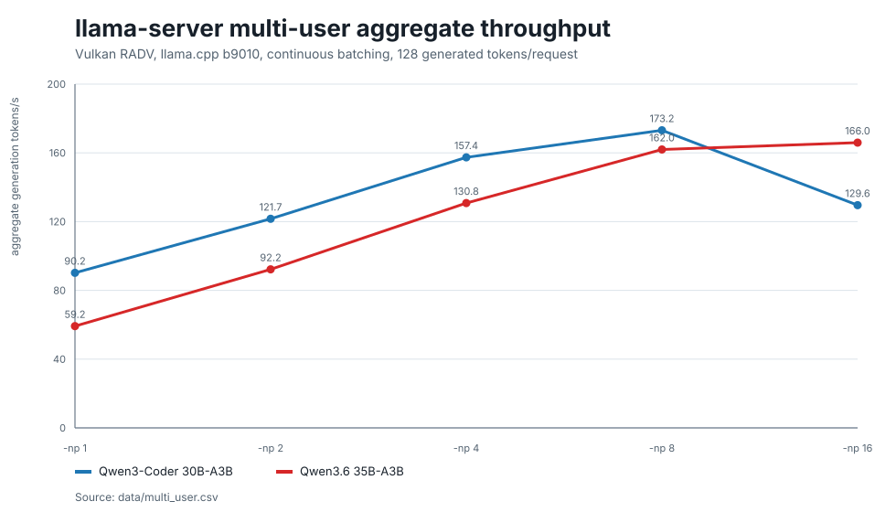
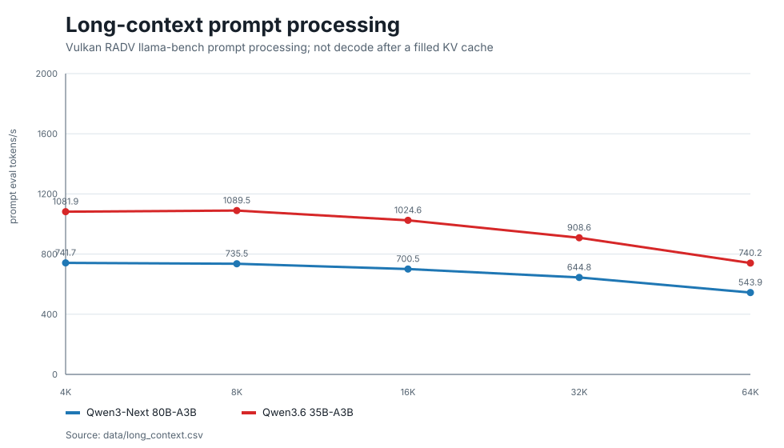
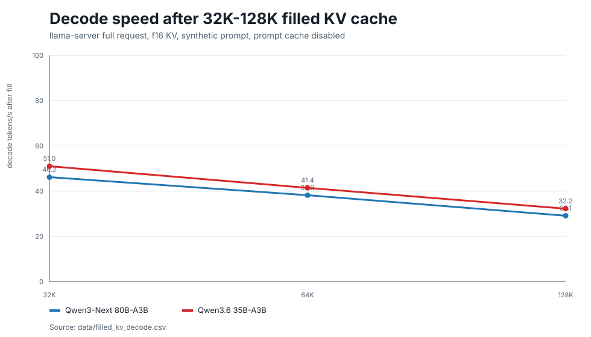
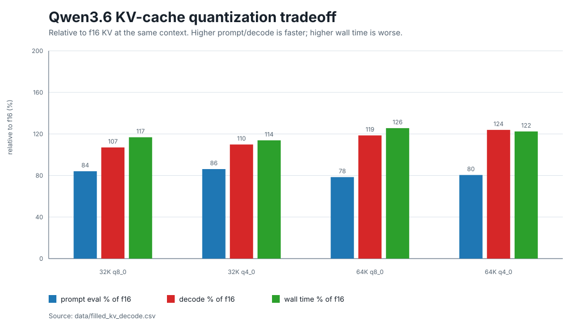
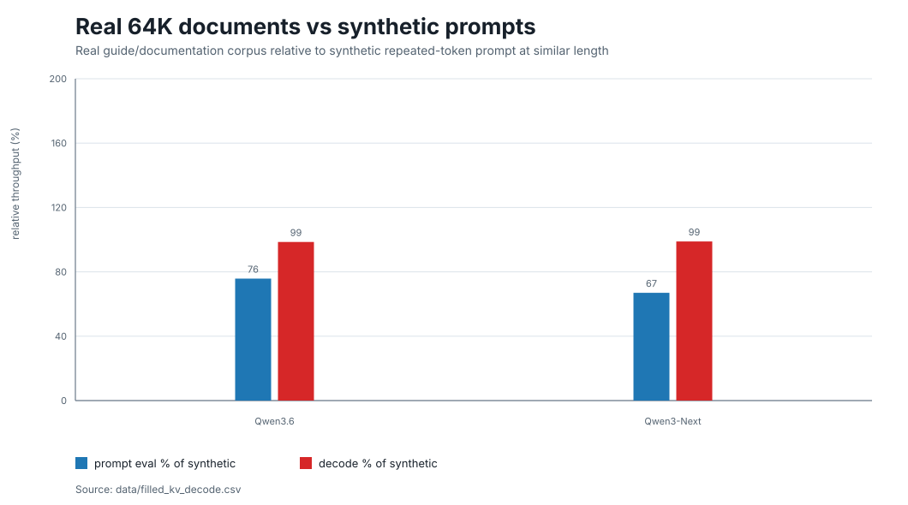
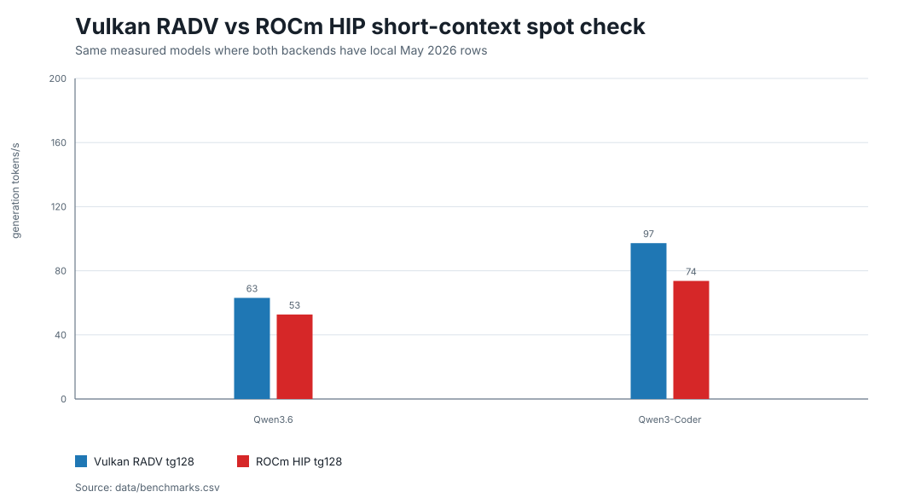

[](COMMUNITY_RESULTS.md)


[](https://github.com/hogeheer499-commits/strix-halo-guide/actions/workflows/validate.yml)

# AMD Strix Halo Local LLM Guide

Reproducible local LLM setup and benchmark evidence for AMD Strix Halo / Ryzen AI MAX+ 395 systems.

What you get:

- Copyable Ubuntu + Vulkan/RADV setup for Ollama and `llama.cpp`.
- Practical model/backend choices for a local AI PC.
- Direct local results: Qwen3-Coder 30B at 98.5 t/s, Qwen3-30B-A3B-Instruct-2507 IQ4_XS at 100.0 t/s, LFM2.5 8B-A1B at 170.0 t/s generation-only, and Nemotron 3 Super 120B-A12B at 18.4 t/s direct on Vulkan/RADV.
- Experimental server route: Qwen3.6 MTP at 101.1 t/s with `llama-server` speculative decoding.
- Raw CSVs, logs, charts, and reproducibility notes for headline claims.
- Community validation from Beelink, Corsair, GMKtec, MS-S1-Max, and Nimo Strix Halo systems.

> Measured primarily on one Beelink GTR9 Pro. Community results are kept separate from local headline claims. This repository ships docs, scripts, data, and charts only; no `.exe`, binary `.zip`, browser extensions, or model weights. Raw evidence, commands, caveats, and corrections are linked so results can be checked instead of taken on trust.

[Quick Start](#quick-start-6-steps) | [Setup Script](#setup-script) | [What Runs](#what-you-can-run-quick-snapshot) | [Current Models](CURRENT_MODELS.md) | [Use Cases](#use-this-if-you-want) | [Rules](#community-tested-rules-of-thumb) | [Best Setup](#best-current-setup-tested-here) | [Evidence](#headline-evidence) | [MTP](MTP_SPECULATIVE_DECODING.md) | [Community](COMMUNITY_RESULTS.md) | [Feedback](COMMUNITY_FEEDBACK.md) | [RPC](COMMUNITY_RPC.md) | [USB4](USB4_CLUSTER_TUNING.md) | [Reproduce](#reproduce-one-headline-result) | [Security](SECURITY.md)

---

## Use This Guide If

- You have, ordered, or are evaluating a Strix Halo / Ryzen AI MAX+ 395 system for local AI.
- You want a copyable Ubuntu local-LLM setup instead of piecing together scattered posts.
- You need practical model/backend choices for Ollama, llama.cpp Vulkan/RADV, ROCm, server use, and long context.
- You want benchmark claims that point to CSVs, raw logs, charts, and reproducibility notes.

## What This Gives You

| If you want to... | Start here |
|-------------------|------------|
| Apply the setup without reading everything | [Quick Start](#quick-start-6-steps), then [Setup Script](#setup-script). |
| Decide what to run on your Strix Halo machine | [What You Can Run: Quick Snapshot](#what-you-can-run-quick-snapshot), then [Use This If You Want](#use-this-if-you-want): practical model and backend choices for a local AI PC. |
| Skip the community-data deep dive | [Community-Tested Rules Of Thumb](#community-tested-rules-of-thumb): practical decisions extracted from the Beelink data plus Corsair, GMKtec, MS-S1-Max, and Nimo community reports. |
| See what work was actually done | [Headline Evidence](#headline-evidence): dated claims with backend, model, result, CSV, raw logs, charts, and notes. |
| Check whether the numbers are real | [Reproduce One Headline Result](#reproduce-one-headline-result), [`REPRODUCIBILITY.md`](REPRODUCIBILITY.md), and [`data/headline_claims.csv`](data/headline_claims.csv). |
| Compare against other Strix Halo systems | [`COMMUNITY_RESULTS.md`](COMMUNITY_RESULTS.md): independent benchmark reports kept separate from headline claims, including native Linux, WSL2/HIP, Windows LM Studio, power, tuned thermal/power-policy rows, and Nimo large-model serving evidence. [`COMMUNITY_RPC.md`](COMMUNITY_RPC.md): multi-node USB4 RPC results. [`USB4_CLUSTER_TUNING.md`](USB4_CLUSTER_TUNING.md): cluster latency tuning. |
| See how public corrections change the guide | [`COMMUNITY_FEEDBACK.md`](COMMUNITY_FEEDBACK.md): trust/framing lessons, corrected routes, and examples of community pushback turning into better evidence. |

## 20-Second Summary

| Question | Current answer |
|----------|----------------|
| What was tested? | Local LLM inference and local API serving on Strix Halo, mainly Vulkan/RADV llama.cpp, Ollama, ROCm/HIP, Lemonade `llamacpp-rocm`, and early vLLM smoke tests. |
| Primary hardware | Beelink GTR9 Pro, Ryzen AI MAX+ 395, Radeon 8060S `gfx1151`, 128GB LPDDR5X-8000 unified memory. |
| Best easy path | Ollama 0.23.1 with Vulkan/RADV for chat, model pulling, and Open WebUI. |
| Fastest measured short-context path | Direct llama.cpp / `llama-server` with Vulkan/RADV. Current strict-clean b9179 speed-first Qwen3-Coder Q4_K_S row reached 98.51 t/s r50, and a separate Qwen3-30B-A3B-Instruct-2507 IQ4_XS row reached 100.04 t/s r50 on b9467. The balanced Qwen3-Coder UD row remains 96.76 t/s on the current b9049 campaign; Qwen3.6 reached 62.56 t/s balanced UD and 81.30 t/s speed-first Q4_0. |
| Fastest current small-MoE scout | LFM2.5 8B-A1B Q4_K_M reached 168.96 tg128 in a pp512/tg128 run and 170.02 t/s generation-only on the 2026-06-05 latest/int-dot check. This is a small active-parameter MoE speed result, not a 30B-class capability replacement. |
| Largest current direct GGUF capacity route | Nemotron 3 Super 120B-A12B UD-IQ4_XS ran directly on one 128GB Strix Halo system at 18.43 tg128 on the 2026-06-05 latest/int-dot check. This is capacity/current-model evidence, not a speed headline. |
| Experimental speculative server path | MTP works on current `llama.cpp` master. The best local Qwen3.6 MTP server route now uses IQ4_XS-Q8nextn and reached about 101.1 t/s across six prompts on b9360; the first GMKtec community reproduction on b9235 reached 93.3 t/s. This is a server/speculative result, not the direct `llama-bench` headline. |
| Latest-stack delta | llama.cpp `de6f727aa` was checked on 2026-06-01 and did not improve the current direct Qwen3-Coder headline rows. A 2026-06-02 b9467 scout added the separate direct 100.04 t/s Qwen3-30B-A3B-Instruct-2507 IQ4_XS route. A 2026-06-05 latest/int-dot check added LFM2.5 170.02 t/s generation-only, Nemotron Nano 75.97 t/s, Nemotron Super 18.43 t/s, and a Qwen3-Coder UD negative/control row at 92.84 t/s. |
| Large local model checks | gpt-oss-120b MXFP4 split GGUF loaded locally at 55.57 t/s tg128; Nemotron 3 Super 120B-A12B UD-IQ4_XS loaded directly at 18.43 t/s; MiniMax M2.7 230B-class MoE loaded and generated locally in a capacity scout. |
| Best measured Qwen3.6 server path | Vulkan/RADV wins at 1-4 parallel requests; Lemonade `llamacpp-rocm` b1259 wins aggregate throughput at 8-16. |
| Backend split | Vulkan/RADV wins measured generation on the current single-box Qwen rows; ROCm/HIP can win prompt-processing-heavy work, and ROCm RPC is required for the tested MiniMax capacity case. See [`BACKEND_CROSSOVER.md`](BACKEND_CROSSOVER.md) and [`COMMUNITY_RPC.md`](COMMUNITY_RPC.md). |
| Community validation | The public evidence map now covers 8 Strix Halo-class systems. Three Corsair AI Workstation 300 systems reproduced the Qwen3-Coder Vulkan/RADV path at 93.55-95.50 t/s tg128. GMKtec EVO-X2 reports cover native Ubuntu within about 2% of the Beelink Qwen3.6 row, Qwen3-Coder follow-ups, WSL2/HIP, and a tuned Reddit Qwen3-Coder `Q4_K_S` report around 99.9-100.0 t/s. A Windows MS-S1-Max LM Studio report adds the first Windows serving/API row. A Nimo AI Mini PC bundle adds another compact 128GB chassis, large-model serving rows, MTP/StepFun/Qwen 122B evidence, Gemma 4 QAT/MTP assistant-head follow-up data, and thermal context. Community reports also cover quant/source/build effects, same-SKU variance, wall-power efficiency, 3-node USB4 RPC, RPC serving/TTFT, and USB4 tuning. |
| Claim index | [`data/headline_claims.csv`](data/headline_claims.csv) maps each public headline to CSV, raw evidence, chart, and notes. |
| Raw evidence | Structured CSVs in [`data/`](data/README.md), raw logs in [`data/raw/`](data/raw/), generated charts in [`charts/`](charts/README.md). |

## Quick Start (6 Steps)

For those who want to get running as fast as possible:

1. **BIOS:** Set UMA Frame Buffer to 512MB, disable IOMMU.
2. **Install Ubuntu 24.04 LTS**, switch to X11.
3. **Kernel params:** Add `amd_iommu=off amdgpu.gttsize=131072 ttm.pages_limit=31457280` to GRUB.
4. **Performance:** Install tuned, set `accelerator-performance` profile, upgrade Mesa via kisak PPA.
5. **Ollama:** Install, configure Vulkan backend with `OLLAMA_VULKAN=1` and `HIP_VISIBLE_DEVICES=-1`.
6. **Test:** `ollama run qwen3.6:35b-a3b` -- expect ~50 t/s generation.

Each step is detailed in the phases below.

## Setup Script

If you've already set your BIOS (UMA = 512MB, IOMMU = off) and installed Ubuntu 24.04:

```bash
git clone https://github.com/hogeheer499-commits/strix-halo-guide
cd strix-halo-guide
less setup.sh
bash setup.sh
```

For unattended copy/paste installs, the same script can also be run as:

```bash
curl -fsSL https://raw.githubusercontent.com/hogeheer499-commits/strix-halo-guide/main/setup.sh | bash
```

This installs everything, configures Ollama with Vulkan, pulls a model, and runs a benchmark. Takes ~10 minutes plus model download time.

## What You Can Run: Quick Snapshot

This is the quick "what can I actually run on my AI PC?" view. It is not the full benchmark list; see [What You Can Run](#what-you-can-run) for more models and [Headline Evidence](#headline-evidence) for the audit trail.

| What you want to do | Measured local result | Practical takeaway | Evidence |
|---------------------|-----------------------|--------------------|----------|
| Fastest direct 30B-class Qwen MoE row | Qwen3-30B-A3B-Instruct-2507 IQ4_XS: 100.04 t/s direct llama.cpp Vulkan/RADV on b9467 | First local direct `llama-bench` row above 100 t/s. Treat it as a separate general-instruct Qwen route, not as a Qwen3-Coder replacement or balanced-default claim. | [`headline claims`](data/headline_claims.csv), [`raw r50`](data/raw/2026-06-02/qwen3-30b-a3b-2507-direct-scout/qwen3-30b-2507-iq4xs-b9467-r50.csv) |
| Fastest current small-MoE scout | LFM2.5 8B-A1B Q4_K_M: 168.96 tg128 in pp512/tg128, 170.02 t/s generation-only | Shows how fast newer small active-parameter MoE routes can be on Strix Halo. Do not compare it as a 30B-class coding/reasoning replacement. | [`headline claims`](data/headline_claims.csv), [`raw latest/int-dot`](data/raw/2026-06-05/latest-llamacpp-intdot-regression/) |
| Fastest local coding speed | Qwen3-Coder 30B-A3B Q4_K_S: 98.51 t/s direct llama.cpp Vulkan/RADV on b9179 | Speed-first quant candidate. Use it when raw t/s matters and you accept the quality tradeoff. | [`headline claims`](data/headline_claims.csv), [`raw r50`](data/raw/2026-05-16/break-97-24-strict-noise-settings/b9179-q4-k-s-r50.csv) |
| Fast balanced local coding model | Qwen3-Coder 30B-A3B UD-Q4_K_XL: 96.76 t/s direct llama.cpp Vulkan/RADV on current b9049 | Strong first model for coding scripts, editors, and agent loops. | [`headline claims`](data/headline_claims.csv), [`raw run`](data/raw/2026-05-07/max-performance-campaign/benchmarks/qwen3-coder-top-confirm-r20/guide.csv) |
| Newer Qwen coding model | Qwen3-Coder-Next 80B-A3B IQ4_XS: 61.91 t/s direct llama.cpp Vulkan/RADV on b9467 | Modern coding-model row for people who want current Qwen Coder-Next rather than the older 30B speed headline. Use it for capability/currentness, not maximum raw t/s. | [`benchmarks CSV`](data/benchmarks.csv), [`raw run`](data/raw/2026-06-02/modern-model-clean-followup/) |
| Easy private chat setup | Qwen3.6 35B-A3B Q4_K_M: 50.51 t/s through Ollama 0.23.1 API | Good default if you want model pulling, Open WebUI, and simple local chat. | [`headline claims`](data/headline_claims.csv), [`raw API run`](data/raw/2026-05-07/latest-stack-rerun/clean-b9049-rerun/ollama-qwen3.6-35b-a3b-0.23.1-api-r10.csv) |
| Fast all-rounder direct path | Qwen3.6 35B-A3B UD-Q4_K_M: 62.56 t/s direct llama.cpp Vulkan/RADV on current b9049 | Use this when you care more about speed and control than the easiest UI. | [`headline claims`](data/headline_claims.csv), [`raw run`](data/raw/2026-05-07/latest-stack-rerun/clean-b9049-rerun/qwen36-35b-b9049-clean-r20.csv) |
| Fastest Qwen3.6 direct path | Qwen3.6 35B-A3B Q4_0: 81.30 t/s direct llama.cpp Vulkan/RADV on current b9049 | Speed-first option. Use the default/balanced quant if quality matters more than raw t/s. | [`max campaign`](data/max_performance_campaign.csv), [`raw run`](data/raw/2026-05-07/max-performance-campaign/benchmarks/qwen36-top-confirm-r20/q4-0-ub2048.csv) |
| Qwen3.6 27B dense control | Official Qwen3.6 27B MTP Q8_0: 7.61-7.74 t/s without MTP, 14.59-14.69 t/s with the best MTP setting; a direct b9467 `llama-bench` follow-up measured 7.70 t/s tg128 | Useful practical row for people comparing 27B versus 35B-A3B. It runs, but this dense Q8 route is much slower than the 35B-A3B MoE paths and is not a speed candidate. | [`Performance notes`](PERFORMANCE_NOTES.md#qwen36-27b-mtp-q8_0-status), [`MTP CSV`](data/mtp_speculative.csv), [`raw b9235`](data/raw/2026-05-19/qwen36-27b-mtp-q8-llamacpp-9235/), [`raw latest`](data/raw/2026-06-01/qwen36-27b-mtp-latest-de6f727/), [`raw b9467`](data/raw/2026-06-02/reddit-look-int-dot-reproduction/) |
| Experimental Qwen3.6 MTP server path | Qwen3.6 35B-A3B MTP IQ4_XS-Q8nextn: 101.16 t/s best local Beelink six-prompt average on b9360, with t16 repeats at 101.15 / 101.10 / 101.06 t/s; first GMKtec community reproduction reached 93.29 t/s on b9235 | Advanced speculative-decoding route. Useful if you are testing a local API server; keep separate from direct `llama-bench`. | [`MTP notes`](MTP_SPECULATIVE_DECODING.md), [`MTP CSV`](data/mtp_speculative.csv), [`local raw`](data/raw/2026-05-27/latest-llamacpp-b9360/), [`GMKtec raw`](data/raw/2026-05-19/community-gmktec-mtp-issue18/) |
| 80B MoE coding/reasoning experiments | Qwen3-Next 80B-A3B UD-Q4_K_XL: 59.06 t/s direct llama.cpp Vulkan/RADV on b9172 | Best current 80B Qwen-family path measured here; use when model size and 256K context matter more than smallest footprint. | [`headline claims`](data/headline_claims.csv), [`raw r20`](data/raw/2026-05-16/latest-stack-b9172/qwen3-next-confirm-r20/qwen3-next-80b-b9172-ub1024-r20.csv) |
| Open-weight 120B reasoning model | gpt-oss-120b MXFP4: 55.57 t/s direct llama.cpp Vulkan/RADV on current b9049 | 128GB unified memory can run a 117B-parameter MoE locally; this is speed evidence, not a model-quality eval. | [`headline claims`](data/headline_claims.csv), [`raw run`](data/raw/2026-05-07/max-performance-campaign/benchmarks/gpt-oss-120b-long-context-vulkan/) |
| Current 120B-class GGUF capacity route | Nemotron 3 Super 120B-A12B UD-IQ4_XS: 18.43 t/s direct llama.cpp Vulkan/RADV | Answers a different buyer question: yes, a current 120B-class MoE GGUF route can run directly on one 128GB Strix Halo box. | [`headline claims`](data/headline_claims.csv), [`raw latest/int-dot`](data/raw/2026-06-05/latest-llamacpp-intdot-regression/) |
| Local API for tools or several clients | Qwen3-Coder 30B-A3B: 173.16 aggregate t/s at `-np 8` | A small AI server can feed multiple local workflows without cloud APIs. | [`multi-user CSV`](data/multi_user.csv), [`chart`](charts/multi_user_aggregate.svg) |
| Long documents or codebase context | Qwen3.6 35B-A3B: 32.23 t/s decode after a filled 128K KV cache | Long-context use is possible, but prompt ingestion cost matters. | [`filled KV CSV`](data/filled_kv_decode.csv), [`chart`](charts/filled_kv_decode.svg) |
| Large-model proof point | MiniMax M2.7 230B-class MoE loaded and generated locally; Llama 4 Scout 109B measured 18.32 t/s historically | 128GB unified memory makes very large local models practical on one compact PC, but capacity and speed are different wins. | [`CURRENT_MODELS.md`](CURRENT_MODELS.md), [`benchmarks CSV`](data/benchmarks.csv) |

## Use This If You Want

| Goal | Start with | Why | Evidence |
|------|------------|-----|----------|
| Easiest private local chat | Ollama Vulkan/RADV | easiest model pulling and Open WebUI path | 50.51 t/s warm Qwen3.6 API average, [`data/benchmarks.csv`](data/benchmarks.csv) |
| Fast coding or scripts on one machine | `llama-server` Vulkan/RADV | fastest measured Qwen3.6 path at 1-4 parallel requests | [`SERVER_SHOOTOUT.md`](SERVER_SHOOTOUT.md) |
| Speculative decoding experiments | `llama-server` MTP on current master | measured server speedup on Qwen3.6 MTP GGUFs; latest local route averages about 101.1 t/s on b9360, GMKtec community reproduction reached 93.3 t/s on b9235, and favorable prompts can exceed 100 t/s | [`MTP_SPECULATIVE_DECODING.md`](MTP_SPECULATIVE_DECODING.md) |
| Several local tools or users hitting one API | Lemonade `llamacpp-rocm` b1259 | best measured Qwen3.6 aggregate throughput at 8-16 parallel requests | [`data/server_shootout.csv`](data/server_shootout.csv) |
| Long local documents or codebase context | `llama-server` Vulkan/RADV first, test ROCm/HIP for prompt-heavy ingestion | 128K prompt plus generation completed; HIP can win prompt processing | [`data/filled_kv_decode.csv`](data/filled_kv_decode.csv), [`BACKEND_CROSSOVER.md`](BACKEND_CROSSOVER.md) |
| vLLM-style serving experiments | ROCm vLLM containers only as experiments | smoke-tested, but no 27B/35B throughput claim yet | [`VLLM_BASELINE.md`](VLLM_BASELINE.md), [`ROCM_VLLM_BUGWATCH.md`](ROCM_VLLM_BUGWATCH.md) |

## Community-Tested Rules Of Thumb

These are the practical decisions extracted from the primary Beelink runs plus Fail-Safe's Corsair AI Workstation 300 reports and mottledMantis' GMKtec EVO-X2 reports. Use them to avoid retesting dead ends first; follow the evidence links if your setup differs.

| Situation | Do this first | Why | Evidence |
|-----------|---------------|-----|----------|
| One Strix Halo AI PC | Use Vulkan/RADV for GGUF chat, coding, and generation-heavy inference. | It is the fastest measured practical path for the main Qwen MoE rows. | [`headline claims`](data/headline_claims.csv), [`COMMUNITY_RESULTS.md`](COMMUNITY_RESULTS.md) |
| Native Linux on another Strix Halo vendor | Expect the same performance class if backend, model, quant, and command match. | GMKtec EVO-X2 96GB on Ubuntu 26.04, Mesa RADV 26.0.3, and llama.cpp b9156 reproduced the guide's Qwen3.6 UD-Q4_K_M row within -0.8% pp512 and -1.7% tg128. | [`COMMUNITY_RESULTS.md`](COMMUNITY_RESULTS.md), [#16](https://github.com/hogeheer499-commits/strix-halo-guide/issues/16) |
| Comparing Qwen3-Coder rows | Preserve the exact command flags before calling one system faster. | The GMKtec Qwen3-Coder b9235 follow-up measured 91.40-92.11 tg128, but the full row used smaller batch settings, `flash_attn=0`, and `use_mmap=1`, so it is portability evidence rather than a Beelink headline replacement. | [`COMMUNITY_RESULTS.md`](COMMUNITY_RESULTS.md), [#17](https://github.com/hogeheer499-commits/strix-halo-guide/issues/17) |
| Handling "older model" criticism | Add current-model rows, but keep speed and capability separate. | Qwen3-Coder-Next IQ4_XS runs locally at 61.91 t/s on the Beelink with b9467. That is a useful modern coding-model result, but it does not replace the older Qwen3-Coder 30B Q4_K_S speed-first headline. | [`raw Qwen3-Coder-Next run`](data/raw/2026-06-02/modern-model-clean-followup/), [`data/benchmarks.csv`](data/benchmarks.csv) |
| Seeing a direct 100 t/s 30B-class Qwen result | Check the exact model and quant before comparing. | The first local direct `llama-bench` 100+ row is Qwen3-30B-A3B-Instruct-2507 IQ4_XS on b9467 at 100.04 t/s r50. It proves another 30B-class Qwen MoE route can cross 100 t/s on Strix Halo, but it is not the same model or quant as the Qwen3-Coder 98.51 t/s headline. | [`raw scout`](data/raw/2026-06-02/qwen3-30b-a3b-2507-direct-scout/), [`PERFORMANCE_NOTES.md#qwen3-30b-a3b-instruct-2507-direct-100-ts-status`](PERFORMANCE_NOTES.md#qwen3-30b-a3b-instruct-2507-direct-100-ts-status) |
| Seeing Qwen3-Coder around 100 t/s on another Strix Halo box | Treat it as a tuned-system clue, not a default claim. Capture thermals, power policy, Vulkan device line, `glslc --version`, driver/toolchain details, and exact command. | A Reddit GMKtec EVO-X2 report saw most `Q4_K_S -p 0 -n 128` runs around 99.90 t/s and a best 100.0 t/s after repasting, reseating memory pads, and using GPU `high` plus CPU EPP `performance`. Local Beelink b9467 follow-ups stayed around 95.27-96.72 t/s, so thermals/power/toolchain still need to be separated before calling this generally reproducible. | [`COMMUNITY_RESULTS.md#reddit-gmktec-evo-x2-tuned-100-ts-report`](COMMUNITY_RESULTS.md#reddit-gmktec-evo-x2-tuned-100-ts-report), [`PERFORMANCE_NOTES.md#vulkan-integer-dot-and-100-ts-reproduction-status`](PERFORMANCE_NOTES.md#vulkan-integer-dot-and-100-ts-reproduction-status), [`raw reproduction`](data/raw/2026-06-02/reddit-look-int-dot-reproduction/) |
| Starting on Windows | LM Studio Vulkan is now a documented Windows path, but keep it separate from Linux `llama-bench`. | The first Windows MS-S1-Max report measured a 89.49 tok/s script average through LM Studio with `n_parallel=4` and 262K context; the long 512-token prompt rows were around 69-70 tok/s. This is useful Windows buyer evidence, not a same-machine Windows-vs-Linux comparison. | [`COMMUNITY_RESULTS.md#windows-lm-studio-ms-s1-max-report`](COMMUNITY_RESULTS.md#windows-lm-studio-ms-s1-max-report), [`raw Windows report`](data/raw/2026-06-02/community-windows-lmstudio-issue3/) |
| Evaluating a compact non-Beelink chassis | Look for setup metadata, thermal context, and large-model feasibility, not only headline t/s. | The Nimo AI Mini PC issue #4 bundle adds Ubuntu 25.04 / Mesa 25.2.8 / ROCm rows, Qwen 122B-class serving, StepFun 198B-class serving, Qwen3-Coder-Next server rows, DFlash negative/control evidence, Gemma 4 QAT/MTP assistant-head follow-up data, and supplemental fan/power/temperature telemetry. | [`COMMUNITY_NIMO.md`](COMMUNITY_NIMO.md), [`data/community_nimo_issue4.csv`](data/community_nimo_issue4.csv), [`raw Nimo bundle`](data/raw/2026-06-03/community-nimo-issue4/), [`Gemma QAT follow-up`](data/raw/2026-06-06/community-nimo-gemma4-qat-issue4/) |
| Testing MTP/speculative decoding | Treat MTP as an advanced server route, not a direct benchmark replacement. | The exact Qwen3.6 MTP IQ4_XS-Q8nextn route now has a local b9360 rerun at 101.16 t/s best six-prompt average, repeated t16 runs around 101.1 t/s, and a GMKtec b9235 reproduction at 93.29 t/s average. | [`MTP_SPECULATIVE_DECODING.md`](MTP_SPECULATIVE_DECODING.md), [#18](https://github.com/hogeheer499-commits/strix-halo-guide/issues/18) |
| The model fits on one Strix Halo box | Do not use `llama.cpp` RPC for raw single-stream speed. | 2-node RPC lost about 14-22% tg128 on fits-on-one models; 3-node was slower again. | [`COMMUNITY_RPC.md`](COMMUNITY_RPC.md), [`data/community_rpc.csv`](data/community_rpc.csv) |
| A huge GGUF does not fit on one box | Try ROCm RPC first, starting with the smallest node count that fits. | In the tested MiniMax-M2.7 140.8GB case, one box failed, 2-node ROCm worked, and 3-node ROCm was slower. This is a capacity rule from that case, not a universal speedup rule. | [`COMMUNITY_RPC.md`](COMMUNITY_RPC.md) |
| Building a USB4 Strix Halo cluster | Start with MTU 9000 and `pm_qos_resume_latency_us=100`. | MTU 9000 beat 1500 and 65520; `pm_qos` added about +2% tg128 with only about 1.5 W idle cost per toggled box in the community report. | [`USB4_CLUSTER_TUNING.md`](USB4_CLUSTER_TUNING.md) |
| Choosing Qwen3.6 quantization | Use Q4_K_M/UD-Q4_K_M for balanced defaults; use Q4_0 only when speed matters more than quality. | Q4_0 was faster locally and in the Corsair report, but this guide has not made a model-quality claim for it. | [`COMMUNITY_RESULTS.md`](COMMUNITY_RESULTS.md), [`data/community_results.csv`](data/community_results.csv) |
| Serving an interactive local API | Prefer single-box `llama-server` when the model fits. | Community `llama-server` TTFT was about 201 ms on 1 node versus about 301 ms on 2-node RPC, with higher RPC variance. | [`COMMUNITY_RPC.md`](COMMUNITY_RPC.md), [`data/community_rpc_server.csv`](data/community_rpc_server.csv) |
| Comparing your t/s to this guide | Treat about 2% tg128 spread as normal between well-matched Strix Halo systems. | Three matched Corsair boxes showed 0.11% pp512 spread and 2.05% tg128 spread; the GMKtec native Qwen3.6 row landed within 2% of the Beelink row. | [`COMMUNITY_RESULTS.md`](COMMUNITY_RESULTS.md) |
| Estimating electricity and heat | Use wall-power rows as workload-specific context, not universal TDP. | Community wall-power data measured about 150 W / 1.6 J/token for Qwen3-Coder, 148 W / 2.0 J/token for Qwen3.6, 174 W / 3.1 J/token for gpt-oss-120b, and 137 W / 3.4 J/token for Qwen3-Coder-Next. | [`COMMUNITY_RESULTS.md#whole-system-power`](COMMUNITY_RESULTS.md#whole-system-power), [`data/community_power.csv`](data/community_power.csv) |
| Seeing a Vulkan/RADV failure on a huge MoE | Check for per-buffer allocation limits, not only total memory. | MiniMax-M2.7 hit the same 830472192-byte RADV allocation failure on 1-node and RPC follower paths. | [`data/community_rpc_failures.csv`](data/community_rpc_failures.csv), [`COMMUNITY_RPC.md`](COMMUNITY_RPC.md) |

## Results Wanted

Have a Strix Halo / Ryzen AI MAX system? Please share results, even if they are slower, failed, or contradict this guide.

- Open a [benchmark report](https://github.com/hogeheer499-commits/strix-halo-guide/issues/new?template=benchmark-report.md) with your system, BIOS UMA setting, kernel, Mesa/ROCm versions, backend, model, command, CSV/raw output, and notes.
- Open a [power / efficiency report](https://github.com/hogeheer499-commits/strix-halo-guide/issues/new?template=power-report.md) if you can measure wall power, UPS power, or validated board power during the same benchmark command.
- Open a [model request](https://github.com/hogeheer499-commits/strix-halo-guide/issues/new?template=model-request.md) if there is a model/backend combination that should be tested.
- Use [Discussions](https://github.com/hogeheer499-commits/strix-halo-guide/discussions) for setup questions, comparisons, and early results that are not ready for a benchmark issue yet.
- Power telemetry is useful if you have reliable wall-power data; it helps turn raw tokens/sec into tokens-per-watt context for buying, cooling, and always-on server decisions.
- Current community reports live in [`COMMUNITY_RESULTS.md`](COMMUNITY_RESULTS.md), [`COMMUNITY_NIMO.md`](COMMUNITY_NIMO.md), [`COMMUNITY_RPC.md`](COMMUNITY_RPC.md), [`USB4_CLUSTER_TUNING.md`](USB4_CLUSTER_TUNING.md), and the `community_*` CSVs listed in [`data/README.md`](data/README.md).
- See [`SHARE.md`](SHARE.md) for short Reddit/HN/forum text and the current social preview image if you want to share the guide.

## For Vendors, Partners, And Reviewers

This guide is primarily a technical resource for AMD Strix Halo local-AI users. For vendors, reviewers, and partners, it also documents a reproducible way to reduce buyer setup friction and validate real-world local-AI use cases without weakening independent benchmark discipline.

Start with [`ONE_PAGE_BRIEF.md`](ONE_PAGE_BRIEF.md) and [`PARTNERSHIP.md`](PARTNERSHIP.md). Supporting docs cover [`BEELINK_OUTREACH.md`](BEELINK_OUTREACH.md), [`VENDOR_OUTREACH_PLAN.md`](VENDOR_OUTREACH_PLAN.md), [`SPONSORSHIP.md`](SPONSORSHIP.md), [`VENDOR_DISCLOSURE.md`](VENDOR_DISCLOSURE.md), [`BUYER_USE_CASES.md`](BUYER_USE_CASES.md), [`SPONSOR_ROADMAP.md`](SPONSOR_ROADMAP.md), [`TRACTION.md`](TRACTION.md), and [`OUTREACH_TEMPLATES.md`](OUTREACH_TEMPLATES.md).

## Best Current Setup Tested Here

Best current setup from this guide's measured local runs:

- Status: still current for the published first-party guidance as of the 2026-06-05 checks. The Qwen3-Coder speed-first headline remains 98.51 t/s; a separate Qwen3-30B-A3B-Instruct-2507 IQ4_XS scout added a direct 100.04 t/s 30B-class Qwen row. The latest/int-dot current-model check added LFM2.5 170.02 t/s generation-only and Nemotron 3 Super 120B-A12B 18.43 t/s capacity evidence without replacing the Qwen3-Coder guidance.
- Ubuntu 24.04.
- BIOS UMA set to 512MB.
- IOMMU disabled for the measured local setup; use `iommu=pt` only if your RDMA/VFIO needs require it.
- Kernel 6.19.4 on the primary measured system.
- Mesa/RADV from kisak-mesa PPA. The main May 7 headline rows used Mesa 26.0.6; the latest May 27 b9360 MTP spot check and June 1 latest-stack controls used Mesa 26.1.1.
- AMDVLK removed so it cannot silently override RADV.
- `tuned` set to `accelerator-performance`.
- Ollama 0.23.1 Vulkan/RADV for easiest local chat and Open WebUI. An isolated Ollama 0.24.0 check did not change the current guidance.
- Direct llama.cpp Vulkan/RADV for fastest measured generation-heavy and low-concurrency Qwen MoE inference.
- Lemonade `llamacpp-rocm` b1259 for the best measured Qwen3.6 aggregate throughput at 8-16 parallel requests.
- ROCm/HIP for prompt-processing-heavy experiments, high-concurrency server paths, vLLM, batching, and future long-context work; not as the current default generation path.

## Headline Evidence

The machine-readable index for these rows is [`data/headline_claims.csv`](data/headline_claims.csv).

Dates below are measurement dates. A row being from May does not mean it is stale; it means later checks did not produce a stronger replacement headline. The latest June 5 controls are documented in [`CURRENT_MODELS.md`](CURRENT_MODELS.md), [`BENCHMARKS.md`](BENCHMARKS.md), [`PERFORMANCE_NOTES.md`](PERFORMANCE_NOTES.md), and the raw evidence links below.

| Claim | Date | Backend | Model | Result | CSV | Raw | Chart | Notes |
|-------|------|---------|-------|--------|-----|-----|-------|-------|
| Fastest direct 30B-class Qwen MoE route | 2026-06-02 | llama.cpp Vulkan/RADV b9467 | Qwen3-30B-A3B-Instruct-2507 IQ4_XS | 100.04 tg128 r50, 1416.03 pp512; r20 was 100.58 tg128 | [`benchmarks`](data/benchmarks.csv) | [`raw r50`](data/raw/2026-06-02/qwen3-30b-a3b-2507-direct-scout/qwen3-30b-2507-iq4xs-b9467-r50.csv) | n/a | first local direct `llama-bench` row above 100 t/s; separate general-instruct Qwen route; not the Qwen3-Coder headline or balanced default |
| Fastest current small-MoE scout | 2026-06-05 | llama.cpp Vulkan/RADV 2016bf2 | LFM2.5 8B-A1B Q4_K_M | 168.96 tg128, 3414.61 pp512; generation-only 170.02 tg128 | [`benchmarks`](data/benchmarks.csv) | [`raw latest/int-dot`](data/raw/2026-06-05/latest-llamacpp-intdot-regression/) | n/a | small active-parameter MoE speed/currentness row; not a 30B-class model replacement |
| Largest current direct GGUF capacity route | 2026-06-05 | llama.cpp Vulkan/RADV 2016bf2 | Nemotron 3 Super 120B-A12B UD-IQ4_XS | 18.43 tg128, 294.99 pp512 | [`benchmarks`](data/benchmarks.csv) | [`raw latest/int-dot`](data/raw/2026-06-05/latest-llamacpp-intdot-regression/) | n/a | direct 120B-class MoE route on one 128GB Strix Halo system; capacity/current-model proof, not a speed headline |
| Fastest measured short-context coding MoE speed-first quant | 2026-05-16 | llama.cpp Vulkan/RADV b9179 | Qwen3-Coder 30B-A3B Q4_K_S | 98.51 tg128 r50, 1396.11 pp512 | [`benchmarks`](data/benchmarks.csv) | [`raw r50`](data/raw/2026-05-16/break-97-24-strict-noise-settings/b9179-q4-k-s-r50.csv) | n/a | speed-first lower-quality quant; strict-clean host state; not the balanced UD default |
| Fast balanced short-context coding MoE | 2026-05-07 | llama.cpp Vulkan/RADV b9049 | Qwen3-Coder 30B-A3B UD-Q4_K_XL | 96.76 tg128, 1320.52 pp512 | [`max campaign`](data/max_performance_campaign.csv) | [`raw run`](data/raw/2026-05-07/max-performance-campaign/benchmarks/qwen3-coder-top-confirm-r20/guide.csv) | n/a | max-performance r20 confirmation; previous b9010 peak was 97.24 t/s |
| Default Qwen3.6 direct path | 2026-05-07 | llama.cpp Vulkan/RADV b9049 | Qwen3.6 35B-A3B UD-Q4_K_M | 62.56 tg128, 1059.45 pp512 | [`benchmarks`](data/benchmarks.csv) | [`raw run`](data/raw/2026-05-07/latest-stack-rerun/clean-b9049-rerun/qwen36-35b-b9049-clean-r20.csv) | [`chart`](charts/backend_spot_check.svg) | clean latest-stack r20 rerun; rounds to 63 t/s |
| Fastest measured Qwen3.6 speed-first quant | 2026-05-07 | llama.cpp Vulkan/RADV b9049 | Qwen3.6 35B-A3B Q4_0 | 81.30 tg128, 1243.51 pp512 | [`max campaign`](data/max_performance_campaign.csv) | [`raw run`](data/raw/2026-05-07/max-performance-campaign/benchmarks/qwen36-top-confirm-r20/q4-0-ub2048.csv) | n/a | speed-first lower-quality quant; not the default all-round recommendation without a quality sanity check |
| Experimental Qwen3.6 MTP server path | 2026-05-27 | `llama-server` Vulkan/RADV b9360 | Qwen3.6 35B-A3B MTP IQ4_XS-Q8nextn | 101.16 t/s best local average over six prompts; t16 repeats at 101.15 / 101.10 / 101.06 t/s; 93.29 t/s GMKtec community average on b9235 | [`MTP CSV`](data/mtp_speculative.csv) | [`local raw`](data/raw/2026-05-27/latest-llamacpp-b9360/), [`GMKtec raw`](data/raw/2026-05-19/community-gmktec-mtp-issue18/) | n/a | server/speculative result; localweights Q8-next-token-head quant; not the direct `llama-bench` headline |
| Best current 80B Qwen-family path | 2026-05-16 | llama.cpp Vulkan/RADV b9172 | Qwen3-Next 80B-A3B UD-Q4_K_XL | 59.06 tg128, 751.70 pp512 | [`benchmarks`](data/benchmarks.csv) | [`raw r20`](data/raw/2026-05-16/latest-stack-b9172/qwen3-next-confirm-r20/qwen3-next-80b-b9172-ub1024-r20.csv) | n/a | b9172 improved this 80B MoE path versus the older 54.92 t/s b8933 row |
| gpt-oss-120b loaded locally | 2026-05-07 | llama.cpp Vulkan/RADV b9049 | gpt-oss-120b MXFP4 split GGUF | 55.57 tg128, 726.99 pp512, 293.73 pp65536 r1 | [`max campaign`](data/max_performance_campaign.csv) | [`raw run`](data/raw/2026-05-07/max-performance-campaign/benchmarks/gpt-oss-120b-long-context-vulkan/) | n/a | performance evidence only; no model-quality eval; pp65536 is one repeat |
| Easiest useful Qwen3.6 chat path | 2026-05-07 | Ollama 0.23.1 Vulkan/RADV | Qwen3.6 35B-A3B Q4_K_M | 50.51 t/s warm API generation average | [`benchmarks`](data/benchmarks.csv) | [`raw API run`](data/raw/2026-05-07/latest-stack-rerun/clean-b9049-rerun/ollama-qwen3.6-35b-a3b-0.23.1-api-r10.csv) | n/a | 10 warm API runs; matches 0.21.2 |
| Best measured Qwen3.6 server split | 2026-05-05 | Vulkan/RADV and Lemonade ROCm | Qwen3.6 35B-A3B UD-Q4_K_M | Vulkan wins 1-4 parallel; Lemonade ROCm wins 8-16 | [`server data`](data/server_shootout.csv) | [`raw sweep`](data/raw/2026-05-05/server-shootout/full-sweep-qwen36-workstation-baseline/summary.csv) | n/a | 5 reps per concurrency, 0 errors |
| HIP/Vulkan workload split | 2026-05-07 | Vulkan/RADV and ROCm/HIP from b9049 source | Qwen3.6 35B-A3B, Qwen3-Coder 30B-A3B | HIP won pp16384; Vulkan won tg128 on both local Qwen rows | [`max campaign`](data/max_performance_campaign.csv) | [`same-source matrix`](data/raw/2026-05-07/max-performance-campaign/benchmarks/same-build-hip-vulkan-b9049/) | n/a | HIP binary reports unknown build id due container git safe-directory, but source checkout was b9049 |
| Best measured Qwen3-Coder local API point | 2026-05-03 | `llama-server` Vulkan/RADV b9010 | Qwen3-Coder 30B-A3B UD-Q4_K_XL | 173.16 aggregate t/s at `-np 8` | [`multi-user`](data/multi_user.csv) | [`raw summary`](data/raw/2026-05-03/multi-user-coder/qwen3-coder-30b-ud-llama-server-multi-user-summary.csv) | [`chart`](charts/multi_user_aggregate.svg) | `-np 16` regressed |
| 128K filled-context Qwen3.6 decode completed | 2026-05-03 | `llama-server` Vulkan/RADV b9010 | Qwen3.6 35B-A3B UD-Q4_K_M | 32.23 t/s decode after 128K fill, no truncation | [`filled KV`](data/filled_kv_decode.csv) | [`raw 128K summary`](data/raw/2026-05-03/filled-kv-decode-128k/filled-kv-decode-128k-summary.csv) | [`chart`](charts/filled_kv_decode.svg) | f16 KV, synthetic long prompt |
| Real documents are slower than synthetic repeated prompts | 2026-05-03 | `llama-server` Vulkan/RADV b9010 | Qwen3.6 35B-A3B and Qwen3-Next 80B-A3B | real 64K prompt ingest was 24-33% slower; decode barely changed | [`filled KV`](data/filled_kv_decode.csv) | [`real-corpus summary`](data/raw/2026-05-03/filled-kv-decode-real-corpus/filled-kv-decode-real-corpus-summary.csv) | [`chart`](charts/real_vs_synthetic.svg) | avoids overclaiming synthetic prompt speed |

## Reproduce One Headline Result

Pick the row that matches what you want to verify. The balanced coding row is the best first reproduction target for most users. The direct 100 t/s row is useful if you specifically want to verify the fastest measured 30B-class Qwen speed scout. Keep them separate: they use different model files, quants, builds, and quality tradeoffs.

### Balanced Qwen3-Coder Row

```bash
AMD_VULKAN_ICD=RADV \
VK_ICD_FILENAMES=/usr/share/vulkan/icd.d/radeon_icd.json \
~/llama-cpp-upstream-2026-05-07/build-vulkan/bin/llama-bench \
  -m ~/models/Qwen3-Coder-30B-A3B-Instruct-UD-Q4_K_XL.gguf \
  -fa 1 -ngl 999 -mmp 0 -p 0 -n 128 -r 20 -o csv
```

Measured local result: 96.76 tg128 in the max-performance b9049 campaign: [`raw CSV`](data/raw/2026-05-07/max-performance-campaign/benchmarks/qwen3-coder-top-confirm-r20/guide.csv). This is the practical balanced Qwen3-Coder row. The fastest first-party Qwen3-Coder row is 98.51 tg128 with Q4_K_S on b9179, but that is a speed-first quant and stricter host state: [`raw r50`](data/raw/2026-05-16/break-97-24-strict-noise-settings/b9179-q4-k-s-r50.csv).

### Direct 100 t/s Qwen3 30B Speed Scout

Use this only if you have the exact `Qwen3-30B-A3B-Instruct-2507` `IQ4_XS-3.63bpw` GGUF and a comparable b9467 Vulkan/RADV build. Adjust the binary and model paths to your checkout; the flags, model hash, build, and raw CSV are the reproducibility anchors. This is a direct `llama-bench` result, but it is not Qwen3-Coder and not the balanced default.

```bash
AMD_VULKAN_ICD=RADV \
VK_ICD_FILENAMES=/usr/share/vulkan/icd.d/radeon_icd.json \
~/llama-cpp-b9467/build-vulkan/bin/llama-bench \
  -m ~/models/Qwen3-30B-A3B-Instruct-2507-IQ4_XS-3.63bpw.gguf \
  -fa 1 -ngl 999 -mmp 0 -b 2048 -ub 512 -t 16 --poll 50 -p 512 -n 128 -r 50 -o csv
```

Measured local result: 100.04 tg128 and 1416.03 pp512 on the r50 confirmation: [`raw r50`](data/raw/2026-06-02/qwen3-30b-a3b-2507-direct-scout/qwen3-30b-2507-iq4xs-b9467-r50.csv), [`model hash`](data/raw/2026-06-02/qwen3-30b-a3b-2507-direct-scout/model-iq4xs.sha256), [`scout notes`](data/raw/2026-06-02/qwen3-30b-a3b-2507-direct-scout/README.md).

## Not Yet Proven Here

- A first-party Beelink wall-power tokens-per-watt claim. Local amdgpu `PPT` telemetry exists, and community Corsair wall-power rows exist, but the guide still needs a Beelink wall-meter run before publishing Beelink J/token claims.
- Same-machine Windows versus Linux performance. Windows LM Studio and WSL2/HIP community rows now exist, but they are not same-machine, same-model, same-shape comparisons against native Linux Vulkan/RADV.
- A default first-party 100 t/s Qwen3-Coder claim. The direct Beelink Qwen3-Coder headline remains 98.51 t/s. A tuned community GMKtec report touched 100.0 t/s on Qwen3-Coder, and a separate first-party Qwen3-30B-A3B-Instruct-2507 IQ4_XS route reached 100.04 t/s, but those are separate evidence categories.
- Production-ready NPU/FastFlowLM inference. The kernel sees `amdxdna` and `/dev/accel/accel0`, but XRT/FastFlowLM user-space is not installed and no local NPU LLM row is published yet.
- Reproducible DFlash/PFlash throughput on a comparable Strix Halo workload. Local preflight found relevant source/assets, but there is no supported performance claim yet.
- A vLLM/DFlash server path that competes with `llama-server` or Ollama for a real 35B Strix Halo use case. Plain AWQ without the gated DFlash drafter was only a smoke test here at about 25 t/s.
- A local tuned rocWMMA long-context comparison against the current Vulkan/RADV path. External rocWMMA evidence exists, but the local lhl branch built here failed to load the current Qwen3.6 GGUFs.
- Multi-machine clustering numbers from this guide's own hardware. Community RPC and USB4 tuning data exists in [`COMMUNITY_RPC.md`](COMMUNITY_RPC.md) and [`USB4_CLUSTER_TUNING.md`](USB4_CLUSTER_TUNING.md), but it is not a local Beelink headline claim.

## Do Not Copy These Claims Without Matching Setup

These numbers are local measurements from one primary machine: a Beelink GTR9 Pro with Ryzen AI MAX+ 395 and 128GB LPDDR5X-8000. Treat the headline results as directional unless your setup matches the measured run closely.

Performance depends on the exact hardware SKU, RAM configuration, BIOS UMA setting, IOMMU setting, firmware, kernel, Mesa/RADV version, ROCm version, Vulkan ICD selection, power profile, GPU clocks, thermal state, backend commit/build flags/container image, model file, quant type, model hash/path, context length, prompt length, generated token count, batch size, parallel slots, request concurrency, API endpoint, environment variables, and background system load.

If your setup differs, rerun the benchmark scripts and cite the date, command, CSV, raw log, chart, model file, and backend version with any copied claim.

## Documentation Map

| File | Purpose |
|------|---------|
| [`REPRODUCIBILITY.md`](REPRODUCIBILITY.md) | Exact machine, BIOS/software state, commands, raw data paths, and chart generation. |
| [`SERVER_SHOOTOUT.md`](SERVER_SHOOTOUT.md) | Practical local-AI-server comparison: Ollama, `llama-server`, Lemonade ROCm, and vLLM candidates. |
| [`BACKEND_CROSSOVER.md`](BACKEND_CROSSOVER.md) | HIP versus Vulkan workload split: prompt processing versus token generation. |
| [`POWER_BASELINE.md`](POWER_BASELINE.md) | Local amdgpu `PPT` telemetry status and Beelink power-sampling caveats. |
| [`PERFORMANCE_NOTES.md`](PERFORMANCE_NOTES.md) | Narrow notes on strict-stack reruns, failed headline reproduction attempts, and useful negative model results. |
| [`CURRENT_MODELS.md`](CURRENT_MODELS.md) | Current-model triage: latest model scouts, speed versus capability framing, and practical next-test value. |
| [`ROCM_VLLM_BUGWATCH.md`](ROCM_VLLM_BUGWATCH.md) | Fast-moving ROCm/vLLM upstream issue and release watchlist. |
| [`BENCHMARKS.md`](BENCHMARKS.md) | Compact benchmark source-of-truth for current README numbers. |
| [`COMMUNITY_RESULTS.md`](COMMUNITY_RESULTS.md) | Independent benchmark reports from other Strix Halo systems, kept separate from headline claims. |
| [`COMMUNITY_FEEDBACK.md`](COMMUNITY_FEEDBACK.md) | Community feedback loop: trust friction, public corrections, and how criticism turns into reproducible evidence. |
| [`COMMUNITY_NIMO.md`](COMMUNITY_NIMO.md) | Nimo AI Mini PC community bundle with large-model, MTP, StepFun, Qwen 122B, Gemma 4 QAT/MTP assistant-head, and thermal context. |
| [`COMMUNITY_RPC.md`](COMMUNITY_RPC.md) | Community multi-node `llama.cpp` RPC over USB4 results, kept separate from single-machine headline claims. |
| [`USB4_CLUSTER_TUNING.md`](USB4_CLUSTER_TUNING.md) | Community USB4 latency tuning for active Strix Halo cluster nodes. |
| [`CONTRIBUTORS.md`](CONTRIBUTORS.md) | Community benchmark contributor credits and contribution path. |
| [`CONTRIBUTING.md`](CONTRIBUTING.md) | What data is most useful, which issue template to use, and how community reports become structured evidence. |
| [`data/headline_claims.csv`](data/headline_claims.csv) | Machine-readable map from public headline claims to data, raw evidence, charts, and notes. |
| [`data/README.md`](data/README.md) | Structured CSV schema and raw-data conventions. |
| [`charts/README.md`](charts/README.md) | Generated chart inventory and regeneration command. |
| [`SHARE.md`](SHARE.md) | Copyable Reddit/HN/forum/Discord text and share links. |
| [`SECURITY.md`](SECURITY.md) | Official-source and impersonation reporting policy. |
| [`SUPPORT.md`](SUPPORT.md) | How to support ongoing testing without changing the evidence-first benchmark policy. |
| [`ONE_PAGE_BRIEF.md`](ONE_PAGE_BRIEF.md), [`PARTNERSHIP.md`](PARTNERSHIP.md), [`SPONSORSHIP.md`](SPONSORSHIP.md), [`VENDOR_DISCLOSURE.md`](VENDOR_DISCLOSURE.md) | Vendor/partner-facing explanation of how the technical proof layer reduces buyer adoption friction while preserving independence. |
| [`BUYER_USE_CASES.md`](BUYER_USE_CASES.md), [`SPONSOR_ROADMAP.md`](SPONSOR_ROADMAP.md), [`TRACTION.md`](TRACTION.md), [`BEELINK_OUTREACH.md`](BEELINK_OUTREACH.md), [`VENDOR_OUTREACH_PLAN.md`](VENDOR_OUTREACH_PLAN.md), [`OUTREACH_TEMPLATES.md`](OUTREACH_TEMPLATES.md) | Buyer-use-case, roadmap, public-evidence, and outreach support docs. |

## Table of Contents

- [20-Second Summary](#20-second-summary)
- [Use This Guide If](#use-this-guide-if)
- [Quick Start (6 Steps)](#quick-start-6-steps)
- [Setup Script](#setup-script)
- [What You Can Run: Quick Snapshot](#what-you-can-run-quick-snapshot)
- [Use This If You Want](#use-this-if-you-want)
- [Community-Tested Rules Of Thumb](#community-tested-rules-of-thumb)
- [Results Wanted](#results-wanted)
- [Community Results](COMMUNITY_RESULTS.md)
- [Best Current Setup Tested Here](#best-current-setup-tested-here)
- [Headline Evidence](#headline-evidence)
- [Reproduce One Headline Result](#reproduce-one-headline-result)
- [Not Yet Proven Here](#not-yet-proven-here)
- [Do Not Copy These Claims Without Matching Setup](#do-not-copy-these-claims-without-matching-setup)
- [Documentation Map](#documentation-map)
- [Hardware](#hardware)
- [What You Can Run](#what-you-can-run)
- [Benchmark Results](#benchmark-results)
  - [Benchmark Charts](#benchmark-charts)
  - [Ollama Vulkan (RADV)](#ollama-vulkan-radv-ollama-0231)
  - [llama-server Multi-User Serving](#llama-server-multi-user-serving-b9010)
  - [ROCm HIP (llama.cpp)](#rocm-hip-llamacpp)
  - [Backend Comparison](#backend-comparison-table)
  - [Hardware Comparison](#hardware-comparison)
  - [Long Context Performance](#long-context-performance)
- [Backend Decision Guide](#backend-decision-guide)
- [Server Shootout](SERVER_SHOOTOUT.md)
- [Phase 1: BIOS Configuration](#phase-1-bios-configuration)
- [Phase 2: Ubuntu 24.04 Installation](#phase-2-ubuntu-2404-installation)
- [Phase 3: Kernel Configuration](#phase-3-kernel-configuration)
- [Phase 4: Performance Tuning](#phase-4-performance-tuning)
- [Phase 5: Ollama Setup (Vulkan)](#phase-5-ollama-setup-vulkan)
- [Phase 6: Benchmarking](#phase-6-benchmarking)
- [Phase 7: ROCm with llama.cpp (Containers)](#phase-7-rocm-with-llamacpp-containers)
- [Phase 8: vLLM Serving](#phase-8-vllm-serving)
- [Phase 9: Multi-Node Clustering (RDMA)](#phase-9-multi-node-clustering-rdma)
- [Phase 10: SSH and Remote Access](#phase-10-ssh-and-remote-access)
- [Vulkan Driver Comparison](#vulkan-driver-comparison)
- [Key Findings and Corrections](#key-findings-and-corrections)
- [Known Issues](#known-issues)
- [Troubleshooting](#troubleshooting)
- [Kernel and ROCm Compatibility](#kernel-and-rocm-compatibility)
- [Power Measurement Status](#power-measurement-status)
- [Testing Checklist](#testing-checklist)
- [Model Recommendation Guide](#model-recommendation-guide)
- [Cost: Local vs Cloud](#cost-local-vs-cloud)
- [Buying Guide](#buying-guide)
- [Glossary](#glossary)
- [FAQ](#faq)
- [Community Resources](#community-resources)
- [Credits and References](#credits-and-references)
- [Contributing](#contributing)
- [Changelog](#changelog)
- [License](#license)

---

## Hardware

### Tested Systems

| System | CPU | GPU | RAM | Notes |
|--------|-----|-----|-----|-------|
| **Beelink GTR9 Pro** | Ryzen AI MAX+ 395 | Radeon 8060S (40 CU) | 128GB LPDDR5X-8000 | This guide's primary test system |
| Corsair AI Workstation 300 | Ryzen AI MAX+ 395 | Radeon 8060S (40 CU) | 128GB LPDDR5X-8000 | Three community systems reproduced the Qwen3-Coder path |
| Framework Desktop | Ryzen AI MAX+ 395 | Radeon 8060S (40 CU) | 128GB LPDDR5X-8000 | Used by kyuz0, lhl |
| GMKtec EVO-X2 | Ryzen AI MAX+ 395 | Radeon 8060S (40 CU) | 96GB or 128GB LPDDR5X-8000 | Native 96GB community run reproduced the Qwen3.6 row; a separate tuned Reddit GMKtec report touched 100.0 t/s on Qwen3-Coder `Q4_K_S`; [pablo-ross guide](https://github.com/pablo-ross/strix-halo-gmktec-evo-x2) |
| Minisforum MS-S1-Max | Ryzen AI MAX+ 395 | Radeon 8060S (40 CU) | 128GB LPDDR5X | Windows LM Studio community serving report imported; not a same-shape Linux comparison |
| Nimo AI Mini PC | Ryzen AI MAX+ 395 | Radeon 8060S (40 CU) | 128GB LPDDR5X | Community issue #4 bundle imported; adds compact-chassis large-model serving, MTP, StepFun/Qwen 122B, Gemma 4 QAT/MTP assistant-head follow-up data, and thermal context |
| HP ZBook Ultra G1a | Ryzen AI MAX+ 395 | Radeon 8060S (40 CU) | 128GB LPDDR5X-8000 | Workstation laptop |

### Strix Halo Specs

| Component | Spec |
|-----------|------|
| CPU | AMD Ryzen AI MAX+ 395 (16 cores / 32 threads, Zen 5) |
| GPU | Radeon 8060S (gfx1151, RDNA 3.5, 40 CUs) |
| RAM | 96GB or 128GB unified LPDDR5X-8000 depending on vendor; primary measured system is 128GB (~215 GB/s measured, 256 GB/s theoretical) |
| NPU | RyzenAI-npu5 (XDNA 2) |

> **Why this hardware?** 96GB/128GB unified memory shared between CPU and GPU means you can run **70B+ models entirely on the GPU** -- something an RTX 4090 (24GB VRAM) cannot do. You trade raw bandwidth (~215 GB/s vs ~1 TB/s on this Beelink) for the ability to run much larger, smarter models on one compact machine. Price changes quickly by vendor; check the [Buying Guide](#buying-guide) before making a purchase decision.

---

## What You Can Run

Real-world generation speeds measured on the Beelink GTR9 Pro, primarily with Vulkan/RADV. Speeds marked with * are via `llama-bench` direct; others are via Ollama unless noted. Use this table to choose a first model, then follow the evidence links above before copying a benchmark claim.

| Model | Size | Type | Generation Speed | Use Case |
|-------|------|------|------------------|----------|
| Qwen3-0.6B (Q8_0) | 0.8 GB | Dense | 266 t/s * | Ultra-fast tiny model |
| Llama 2 7B | 3.8 GB | Dense | 48-52 t/s | Testing, lightweight tasks |
| Qwen2.5-VL 7B | 6.0 GB | Vision | 21.4 t/s | Image understanding |
| LFM2.5 8B-A1B (Q4_K_M) | 5.1 GB | MoE | **170.0 t/s** * | Fastest current small-MoE scout; not a 30B-class replacement |
| Gemma 4 26B-A4B (UD-Q4_K_M) | 15.7 GB | MoE | **48.5 t/s** * | Google MoE model, strong reasoning |
| Qwen3-30B-A3B-Instruct-2507 (IQ4_XS) | 13.9 GB | MoE | **100.0 t/s** * | Fastest direct 30B-class Qwen row; general-instruct route, not Qwen3-Coder |
| Qwen3-Coder 30B-A3B (Q4_K_S) | 17.5 GB | MoE | **98.5 t/s** * | Fastest measured coding speed; speed-first quant, not the balanced default |
| Qwen3-Coder 30B-A3B (UD-Q4_K_XL) | 17.7 GB | MoE | **97 t/s** * | Best coding-model speed/quality ratio; current b9049 measured 96.76 t/s and previous b9010 peak was 97.24 t/s |
| Qwen3.6 35B-A3B (Q4_0) | 19.7 GB | MoE | **81 t/s** * | Fastest measured Qwen3.6 speed-first quant; use a balanced quant if quality matters more than raw speed |
| Qwen3.6 35B-A3B (Q4_K_M / UD-Q4_K_M) | 20-22 GB | MoE | **63 t/s** * | Best all-rounder balanced direct path; separate speed-first/alternate quants reach higher but need quality sanity |
| Qwen3.5 35B-A3B | 23 GB | MoE | 48-**65 t/s** | General purpose, coding (65 with measured direct llama.cpp builds) |
| Qwen3-Coder 30B-A3B (Q8_0) | 32 GB | MoE | 51 t/s | Coding (highest quality MoE) |
| Qwen3-Coder-Next | 51 GB | Dense | 38-39 t/s | Large dense model |
| Llama 3.1 70B (Q4_K_M) | 42 GB | Dense | **4.7-4.9 t/s** | 70B intelligence, doesn't fit on RTX 4090 |
| Llama 4 Scout 109B (Q4_K_M) | 61 GB | MoE | **18.3 t/s** * | 109B params on a mini PC -- RTX 4090 can't even load this |
| Nemotron 3 Nano 30B-A3B (IQ4_XS) | 18.2 GB | MoE | **76.0 t/s** * | Practical NVIDIA Nemotron 30B-class route |
| Nemotron 3 Super 120B-A12B (UD-IQ4_XS) | 64.5 GB | MoE | **18.4 t/s** * | Current 120B-class GGUF route on one 128GB Strix Halo |
| gpt-oss-120b MXFP4 | 63.4 GB | MoE | **55.6 t/s** * | 117B-parameter open-weight model; local load and long-context speed check |
| Qwen3-Next 80B-A3B (UD-Q4_K_XL) | 42.9 GB | MoE | **59 t/s** * | 80B model, 256K context -- faster than dense 51B |
| Kimi K2.5 1T (4-node cluster) | ~500 GB | MoE | distributed | [AMD technical article](https://www.amd.com/en/developer/resources/technical-articles/2026/how-to-run-a-one-trillion-parameter-llm-locally-an-amd.html) |

---

## Benchmark Results

Benchmarks below were run on 2026-03-20, 2026-03-21, 2026-04-26, 2026-05-03, 2026-05-07, 2026-05-16, 2026-05-26, 2026-05-27, 2026-05-31, 2026-06-01, 2026-06-02, and 2026-06-05. Primary benchmark system: Beelink GTR9 Pro. Recorded local runs used kernel 6.19.4, Mesa RADV 26.0.2-26.1.1, AMDVLK removed, and `tuned` `accelerator-performance` where captured; individual raw directories and CSV rows are the source of truth for exact run metadata. Before running new benchmarks, verify `tuned-adm active` and keep `power-profiles-daemon` inactive; it can conflict with `tuned`.

These rows are included because they answer practical setup questions: which model to try first, which backend removes the most friction, which paths are only experimental, and which results are strong enough to cite.

### Benchmark Charts

These generated SVGs summarize the current structured benchmark data. The CSV files in `data/` and raw logs in `data/raw/` remain the source of truth; regenerate charts with `python3 scripts/generate_charts.py`.

| Multi-user serving | Long-context prompt scaling |
|--------------------|-----------------------------|
|  |  |

| Filled-KV decode | KV-cache quantization tradeoff |
|------------------|-------------------------------|
|  |  |

| Real versus synthetic prompts | Backend spot check |
|-------------------------------|--------------------|
|  |  |

### Ollama Vulkan (RADV, Ollama 0.23.1)

**Qwen3.6-35B-A3B** (Q4_K_M, ~20GB, MoE -- Ollama 0.23.1):

| Prompt Tokens | Prompt Eval | Generation | Notes |
|---------------|-------------|------------|-------|
| 19 | 158 t/s | **50.5 t/s** | Controlled 2026-05-07 API warm average across 10 runs; matches 0.21.2 |
| 20 | 163 t/s | 45.6 t/s | Older result, superseded by controlled API run |
| 22 | 174 t/s | 45.4 t/s | Older result, superseded by controlled API run |

**Qwen3.5-35B-A3B** (Q4_K_M, ~23GB, MoE -- Ollama 0.20.4):

| Prompt Tokens | Prompt Eval | Generation | vs Previous (Mesa 26.0.1) |
|---------------|-------------|------------|---------------------------|
| 14 | 121.3 t/s | **48.0 t/s** | tg +4.8% |
| 23 | 182.3 t/s | **47.5 t/s** | tg +4.4% |
| 122 | 456.7 t/s | **47.4 t/s** | tg +4.2% |

**Qwen3-Coder 30B-A3B** (Q8_0, ~32GB, MoE):

| Prompt Tokens | Prompt Eval | Generation | Notes |
|---------------|-------------|------------|-------|
| 12 | 118.3 t/s | **51.4 t/s** | Fastest via Ollama |
| 21 | 205.2 t/s | **51.3 t/s** | Higher quality than Q4_K_M |

**Qwen3-Coder-Next** (~51GB, dense):

| Prompt Tokens | Prompt Eval | Generation | vs Previous |
|---------------|-------------|------------|-------------|
| 12 | 90.7 t/s | **39.1 t/s** | tg +2.9% |
| 21 | 129.5 t/s | **38.4 t/s** | tg +3.8% |
| 120 | 301.2 t/s | **37.9 t/s** | NEW |

**Other Models:**

| Model | Size | Prompt Tokens | pp (t/s) | tg (t/s) |
|-------|------|---------------|----------|----------|
| Llama 2 7B | 3.8 GB | 24 | 384.6 | 52.0 |
| Qwen2.5-VL 7B | 6.0 GB | 23 | 81.7 | 21.4 |
| Qwen3.5 35B (no-think) | 23 GB | 14 | 127.1 | 47.4 |

**Llama 3.1 70B** (Q4_K_M, 42GB, Dense -- the "doesn't fit on RTX 4090" showcase):

| Prompt Tokens | Prompt Eval | Generation | Notes |
|---------------|-------------|------------|-------|
| 14 | 22.1 t/s | 4.9 t/s | Cold start |
| 23 | 36.8 t/s | 4.8 t/s | Realistic chat |
| 122 | 79.6 t/s | 4.7 t/s | Long prompt |

> **Why so slow?** This is a 42GB dense model -- every token reads all 42GB of weights. At ~215 GB/s bandwidth, the theoretical maximum is 215/42 = 5.1 t/s. We hit 4.8 t/s = **94% of the theoretical ceiling**. The model is slow not because of poor optimization, but because it's massive. An RTX 4090 (24GB VRAM) cannot run this model at all. This is the Strix Halo advantage: running models that don't fit on consumer GPUs.

> **What improved?** Mesa 26.0.1 to 26.0.2 plus enabling the `tuned accelerator-performance` profile gave a consistent **+4-5% generation speed improvement** across all models.

### llama-server Multi-User Serving (b9010)

Single-user `llama-bench` tells you the ceiling for one stream. For a real local API box, the more practical question is what happens when multiple tools or users hit `llama-server` at the same time.

**Qwen3.6-35B-A3B** (UD-Q4_K_M, Vulkan RADV, llama.cpp b9010, continuous batching, 4096 context tokens per slot):

| `-np` | Concurrent Requests | Aggregate Generation | Avg per Request | Mean TTFT | Mean ITL | Notes |
|-------|---------------------|----------------------|-----------------|-----------|----------|-------|
| 1 | 1 | 59.21 t/s | 59.21 t/s | 0.117 s | 16.1 ms | Server/API baseline |
| 2 | 2 | 92.21 t/s | 46.11 t/s | 0.198 s | 20.3 ms | Good scaling |
| 4 | 4 | 130.81 t/s | 32.71 t/s | 0.237 s | 29.0 ms | Strong batching gain |
| 8 | 8 | **161.98 t/s** | 20.25 t/s | 0.307 s | 47.4 ms | Practical sweet spot |
| 16 | 16 | 165.98 t/s | 10.38 t/s | 0.547 s | 92.9 ms | Throughput plateau |

> **Takeaway:** continuous batching makes Strix Halo look much stronger as a local API server than single-user tg numbers suggest. `-np 8` delivers about **2.7x** the `-np 1` aggregate throughput while keeping TTFT around 0.3 seconds. `-np 16` works with no errors in this test, but aggregate throughput barely improves while per-user speed drops sharply.

**Qwen3-Coder 30B-A3B** (UD-Q4_K_XL, Vulkan RADV, llama.cpp b9010, continuous batching, 4096 context tokens per slot):

| `-np` | Concurrent Requests | Aggregate Generation | Avg per Request | Mean TTFT | Mean ITL | Notes |
|-------|---------------------|----------------------|-----------------|-----------|----------|-------|
| 1 | 1 | 90.20 t/s | 90.20 t/s | 0.079 s | 10.6 ms | Server/API baseline |
| 2 | 2 | 121.65 t/s | 60.83 t/s | 0.133 s | 15.5 ms | Good scaling |
| 4 | 4 | 157.41 t/s | 39.36 t/s | 0.207 s | 24.0 ms | Strong batching gain |
| 8 | 8 | **173.16 t/s** | 21.65 t/s | 0.382 s | 43.5 ms | Practical sweet spot |
| 16 | 16 | 129.56 t/s | 8.10 t/s | 0.571 s | 119.9 ms | Regression |

> **Coding server takeaway:** `-np 8` is also the best measured setting for Qwen3-Coder, but here `-np 16` is actively worse. More parallel slots are not automatically better.

Raw data: `data/multi_user.csv`, `data/raw/2026-05-03/multi-user/`, and `data/raw/2026-05-03/multi-user-coder/`.

### llama-bench Direct -- Key llama.cpp Builds (b9049, b9010, and b8460) vs kyuz0 Containers (b8298)

> **UPDATE (2026-03-21): Updating llama.cpp from b8298 to b8460 gave +25% on both pp and tg for MoE models.** The new build includes a Vulkan Flash Attention refactor ([PR #19625](https://github.com/ggml-org/llama.cpp/pull/19625)), graphics queue optimization for AMD ([PR #20551](https://github.com/ggml-org/llama.cpp/pull/20551)), and GDN shader support for Qwen3.5 ([PR #20334](https://github.com/ggml-org/llama.cpp/pull/20334)).
>
> **Important caveats:**
> - The +25% improvement is specific to **MoE models on Vulkan** due to the Wave32 FA refactor and graphics queue change. Dense models (Llama 2 7B, Llama 3.1 70B) showed minimal change (<2%) because they were already at the memory bandwidth ceiling.
> - If you use [kyuz0's containers](https://github.com/kyuz0/amd-strix-halo-toolboxes), you get these updates automatically -- the containers rebuild on every llama.cpp master update. kyuz0's toolboxes remain the easiest way to stay current. Our finding here validates the importance of their approach.
> - **WARNING: AMDVLK silently overrides RADV.** If AMDVLK is installed, its `/etc/vulkan/icd.d/amd_icd64.json` takes priority over RADV. This halves your pp speed (1080 -> 660 pp512) without any visible error. Always set `AMD_VULKAN_ICD=RADV` or uninstall AMDVLK entirely: `sudo dpkg -r amdvlk && sudo rm -f /etc/vulkan/icd.d/amd_icd64.json`. Check your driver: RADV shows `(RADV STRIX_HALO) (radv)` with `shared memory: 65536` in llama-bench output. AMDVLK shows `(AMD open-source driver)` with `shared memory: 32768`. We [originally reported this as a llama.cpp regression](https://github.com/ggml-org/llama.cpp/issues/22375) -- it wasn't.

**Qwen3.5-35B-A3B** (Q4_K_M, 19.9GB, MoE) -- the biggest improvement:

| Build | Driver | pp128 | pp512 | tg128 | vs old RADV |
|-------|--------|-------|-------|-------|-------------|
| **b8460 (newer March build)** | **RADV** | **623** | **1080** | **64.85** | **pp +24%, tg +25%** |
| b8460 (newer March build) | AMDVLK | 521 | 663 | 64.10 | pp -24%, tg +23% |
| b8298 (kyuz0) | RADV | 583 | 868 | 52.06 | baseline |
| b8298 (kyuz0) | AMDVLK | 479 | 576 | 56.08 | |

> **Beginner rule: use RADV for Vulkan. Do not install AMDVLK.** In the newer b8460 Vulkan comparison, RADV is faster than AMDVLK on both pp (+63%) and tg (+1.2%), and AMDVLK can silently hijack your Vulkan driver. Advanced note: ROCm/HIP is a different backend, not a Vulkan driver. HIP can still be worth testing for long prompts, RAG ingest, and other prompt-processing-heavy workloads.

Extended context scaling (b8460 RADV):

| pp512 | pp2048 | pp4096 | pp8192 | Drop at 8K |
|-------|--------|--------|--------|------------|
| **1080** | **1057** | **1049** | **1049** | **-3%** |

> pp is virtually flat from 512 to 8192 tokens. Only 3% drop at 8K context.

**Qwen3-Coder 30B-A3B** (Q4_K_S speed-first and UD-Q4_K_XL balanced, MoE):

| Build | Driver | pp512 | tg128 | Notes |
|-------|--------|-------|-------|-------|
| **b9179** | **RADV** | **1396** | **98.51** | Q4_K_S speed-first quant, strict-clean r50 confirmation |
| **b9049** | **RADV** | **1321** | **96.76** | 2026-05-07 max-performance guide-flags r20 confirmation |
| **b9010** | **RADV** | **1346** | **97.24** | Controlled 2026-05-03 two-run r20 average |
| b8460 | RADV | 1342 | 87.11 | Previous headline |
| b8298 (kyuz0) | RADV | 1350 | 86.81 | ~same (model was already at ceiling) |

> A controlled May 2026 rerun moved the balanced Qwen3-Coder 30B headline from 87 t/s to 97 t/s on b9010 Vulkan RADV. The 2026-05-07 b9049 max-performance campaign measured 96.76 t/s on UD-Q4_K_XL. A later strict-clean b9179 run measured 98.51 t/s with Q4_K_S, which is a speed-first quant rather than the default balanced row.

**Gemma 4 26B-A4B** (UD-Q4_K_M, 15.7GB, MoE) -- tested on b8933 (earliest build with Gemma 4 support):

| Build | Driver | pp512 | tg128 | Notes |
|-------|--------|-------|-------|-------|
| **b8933** | **RADV** | **1142** | **48.46** | Google's latest MoE |

> Gemma 4 is architecturally slower on tg than Qwen MoE models despite similar size. The reason: head_dim 256/512 (vs Qwen's 128) makes flash attention less efficient, mixed sliding-window/full attention adds overhead, and 3.8B active params vs Qwen's 3.3B. This is not a llama.cpp issue -- it's inherent to the model design. 48.5 t/s is still 3x human reading speed and very usable for interactive chat.
>
> **WARNING:** Gemma 4 is extremely sensitive to KV cache quantization. Using q8_0 KV cache causes 3.5x worse quality degradation compared to Qwen models. Stick with f16 KV cache for Gemma 4. Do NOT use `--cache-type-k q4_0`.

**Llama 4 Scout 109B** (Q4_K_M, 60.9GB, MoE -- 109B total params, 17B active):

| Build | Driver | pp512 | tg128 | Notes |
|-------|--------|-------|-------|-------|
| **b8933** | **RADV** | **331** | **18.32** | 109B model running on a mini PC |

> A 109 billion parameter model running at 18.3 t/s on a 128GB Strix Halo mini PC. An RTX 4090 (24GB VRAM) cannot even load this model. The speed is bandwidth-limited at 17B active parameters -- theoretical max is ~25 t/s at 215 GB/s, we hit 73% of that ceiling.

**Qwen3-Next 80B-A3B** (UD-Q4_K_XL, 42.9GB, MoE -- 80B total params, 3B active, 256K context):

| Build | Driver | pp512 | tg128 | Notes |
|-------|--------|-------|-------|-------|
| **b9172** | **RADV** | **752** | **59.06** | Latest-stack r20 confirmation; best current 80B Qwen-family path |
| **b8933** | **RADV** | **657** | **54.92** | 80B model at 55 t/s |

> 80 billion parameters running at 59 t/s on a mini PC. This is the largest Qwen3-family MoE model -- 80B total with only 3B active parameters and a 256K context window. Despite being 42.9 GB on disk, the MoE routing keeps only 3B params active per token, making it faster than the 51B dense Qwen3-Coder-Next (38 t/s). The 2026-05-16 b9172 check improved this row, while Qwen3-Coder, Qwen3.6, and gpt-oss did not improve on the same latest-stack rerun.

**Qwen3.6-35B-A3B** (Q4_K_M, 19.9GB, MoE -- drop-in upgrade from Qwen3.5, released April 2026):

| Build | Driver | pp512 | tg128 | Notes |
|-------|--------|-------|-------|-------|
| **b9049** | **RADV** | **1059** | **62.56** | Clean 2026-05-07 latest-stack r20 rerun |
| **b8460** | **RADV** | **1064** | **63.76** | Same speed as Qwen3.5 |
| **b9010** | **RADV** | **1109** | **63.06** | UD-Q4_K_M controlled rerun; plain Q4 blob not loadable by upstream b9010 |
| b8933 | RADV | 1040 | 63.66 | No regression between builds |

> Qwen3.6 is a drop-in replacement for Qwen3.5 with significantly improved coding and reasoning quality (same architecture, same active parameters, effectively identical speed). Older April data showed a 13% UD-Q4_K_M penalty, but the controlled May b9010 and b9049 reruns did **not** reproduce that large gap. Prefer plain Q4_K_M when you have a direct-compatible GGUF, but treat the old "UD is always 13% slower" warning as superseded until same-build plain-vs-UD is rerun.

### ROCm HIP -- usable on kernel 6.19.4 with HSA override

We discovered that `HSA_OVERRIDE_GFX_VERSION=11.5.1` + `HSA_ENABLE_SDMA=0` fixes the ROCm segfault on kernel 6.19.x. We also rebuilt ROCm with the same b8460 source to make the comparison fair:

| Build | pp128 | pp512 | tg128 | Notes |
|-------|-------|-------|-------|-------|
| **b8460 (newer March build, kernel 6.19.4)** | **547** | **1047** | **54.67** | **tg +14% vs b8301** |
| b8301 (self-compiled, kernel 6.19.4) | 542 | 1059 | 47.87 | old build |
| b8301 (self-compiled, kernel 6.18.14) | 488 | 996 | 48.80 | previous best |

> ROCm also improved in the b8460 comparison: tg went from 47.87 to **54.67** (+14%) thanks to generic llama.cpp optimizations. But **Vulkan RADV was still faster on both pp and tg in this short-context pair**: RADV 1080 vs ROCm 1047 pp512 (+3%), RADV 64.85 vs ROCm 54.67 tg128 (+19%). The +25% Vulkan improvement was ~14% generic (ROCm got this too) plus ~11% Vulkan-specific (FA refactor, graphics queue). ROCm's remaining advantage is hipBLASLt and rocWMMA at very long context (32K+).

**ROCm HIP spot check (2026-05-03, b8460 HIP build):**

| Model | Quant | ROCm pp512 | ROCm tg128 | Vulkan Reference |
|-------|-------|------------|------------|------------------|
| Qwen3.6 35B-A3B | UD-Q4_K_M | 1186 | 52.7 | Vulkan b9010: 1109 pp, 63.1 tg |
| Qwen3-Coder 30B-A3B | UD-Q4_K_XL | 1285 | 73.7 | Vulkan b9010: 1346 pp, 97.2 tg |

> This HIP run required `LD_LIBRARY_PATH=/usr/local/lib/ollama/rocm` plus the HSA override and emitted a missing `TensileLibrary_lazy_gfx1151.dat` warning. Treat it as a ROCm HIP baseline, not a tuned rocBLASLt/rocWMMA result. Vulkan RADV remains the recommended short-context generation backend.

**Build version matters enormously:**

| What we tested | pp512 | tg128 | Lesson |
|----------------|-------|-------|--------|
| Ollama Vulkan RADV (b8298) | ~457 (via API) | 47.4 | Ollama adds overhead |
| llama-bench RADV (b8298) | 868 | 52.06 | Eliminating Ollama helps |
| llama-bench RADV **(b8460)** | **1080** | **64.85** | **Updating llama.cpp = +25%** |
| ROCm HIP (b8301, HSA fix) | 1059 | 47.87 | Old build, unfair comparison |
| ROCm HIP **(b8460, HSA fix)** | **1047** | **54.67** | **ROCm got +14% tg from same update** |

> The single biggest optimization in this early campaign was **updating llama.cpp**. It gave more improvement (+25% on MoE models) than all kernel tuning, batch size sweeps, and driver comparisons combined. This is counter-intuitive -- people spend hours on kernel parameters, GRUB flags, and Mesa versions, while a current source build can deliver more than everything else put together. Note: this applies to MoE models specifically. Dense models were already at the bandwidth ceiling and show <2% change.

**Batch size and ubatch tuning results (b8298, for reference):**

We swept batch sizes 64-2048 and ubatch sizes 32-1024. Result: **default 512 is optimal.** No headroom via tuning -- the improvement came from updating the build.

**How to build the latest llama.cpp with Vulkan:**

```bash
git clone https://github.com/ggml-org/llama.cpp
cd llama.cpp
CC=/usr/bin/gcc CXX=/usr/bin/g++ cmake -B build -S . \
  -DGGML_VULKAN=ON \
  -DCMAKE_BUILD_TYPE=Release \
  -G "Unix Makefiles"
cmake --build build -j$(nproc)

# Benchmark
AMD_VULKAN_ICD=RADV ./build/bin/llama-bench \
  -m ~/models/your-model.gguf \
  -fa 1 -ngl 999 -mmp 0 -p 512 -n 128
```

### ROCm on kernel 6.19.x (the fix)

```bash
# Add these environment variables before running llama-bench:
export HSA_OVERRIDE_GFX_VERSION=11.5.1
export HSA_ENABLE_SDMA=0
export ROCBLAS_USE_HIPBLASLT=1
```

**Llama 2 7B** (Q4_K_M, 3.8GB, Dense):

| Driver | pp128 | pp512 | pp1024 | tg128 |
|--------|-------|-------|--------|-------|
| **RADV** | **1154** | **1377** | **1356** | 48.12 |
| AMDVLK | 335 | 327 | 325 | 48.02 |

> AMDVLK is 3-4X slower on pp for dense models (2 GiB buffer limit). Use RADV.

**Qwen3-0.6B** (Q8_0, 762MB, Dense) -- maximum throughput:

| Driver | pp128 | pp512 | tg128 |
|--------|-------|-------|-------|
| RADV | **10,313** | **13,112** | **266** |

### ROCm HIP (llama.cpp)

> **NOTE (March 2026):** Kernel 6.19.x misidentifies gfx1151 as gfx1100 for ROCm, but this is fixable with `HSA_OVERRIDE_GFX_VERSION=11.5.1` and `HSA_ENABLE_SDMA=0`. See [ROCm on kernel 6.19.x](#rocm-on-kernel-619x-the-fix) for the full fix. Without these environment variables, ROCm containers will segfault.

**Previous results on kernel 6.18.14** (for reference -- these worked):

| Build | Model | pp128 | pp512 | tg128 |
|-------|-------|-------|-------|-------|
| Self-compiled b8301, FA on, -mmp 0 | Qwen3.5-35B-A3B Q4_K_M | 488 | 996 | 48.8 |
| kyuz0 b8298, FA on | Qwen3.5-35B-A3B Q4_K_M | 306 | 520 | 55.3 |
| kyuz0 b8298, FA off | Qwen3.5-35B-A3B Q4_K_M | 352 | 524 | 53.8 |
| kyuz0 b8189, FA + hipBLASLt | Llama 2 7B Q4_K_M | 1163 | 1261 | 45.07 |

**Vulkan llama-bench Direct (kyuz0 containers, b8298) -- March 2026:**

| Driver | Model | pp128 | pp256 | pp512 | pp1024 | tg128 |
|--------|-------|-------|-------|-------|--------|-------|
| **RADV** | Qwen3.5-35B-A3B Q4_K_M | **503.67** | - | **858.88** | - | 52.15 |
| **AMDVLK** | Qwen3.5-35B-A3B Q4_K_M | 477.28 | - | 575.59 | - | **55.54** |
| **RADV** | Llama 2 7B Q4_K_M | **1153.53** | **1364.45** | **1377.18** | **1355.88** | 48.12 |
| **AMDVLK** | Llama 2 7B Q4_K_M | 334.50 | 337.96 | 327.35 | 325.33 | 48.02 |

> **Critical finding (b8298):** AMDVLK has a 2 GiB single buffer allocation limit that cripples pp on dense models (3-4X slower on Llama 2 7B). On MoE models, AMDVLK was slightly faster on tg (+6.5%) with b8298, but **this advantage disappeared with b8460** -- see the [key build comparison](#llama-bench-direct-key-llamacpp-builds-b9049-b9010-and-b8460-vs-kyuz0-containers-b8298). For beginners: keep AMDVLK removed and use RADV for Vulkan.

**Vulkan RADV vs ROCm HIP (same build b8460, Qwen3.5-35B-A3B):**

| Metric | Ollama (b8298) | Vulkan RADV (b8460) | ROCm HIP (b8460) | Best |
|--------|----------------|---------------------|-------------------|------|
| pp512 | ~457 | **1080** | 1047 | **Vulkan RADV** |
| tg128 | 47.4 | **64.85** | 54.67 | **Vulkan RADV** |

> **Vulkan RADV wins on both pp512 and tg128 for this Qwen3.5 b8460 short-context pair.** ROCm works on kernel 6.19.x with the HSA override fix, and newer spot checks show HIP can win longer prompt-processing rows. Use `llama-bench` or `llama-server` directly instead of Ollama to avoid the current ~20-25% short-context overhead on Qwen3.6.

### Backend Comparison Table

Based on our measurements and [lhl's detailed testing](https://github.com/lhl/strix-halo-testing):

| Backend | Best For | pp (relative) | tg (relative) | Context Scaling | Setup Difficulty |
|---------|----------|---------------|---------------|-----------------|------------------|
| Ollama + Vulkan RADV | General use, chat | Good | Good | Degrades at 8K+ | Easiest |
| llama.cpp + Vulkan RADV (container) | Max speed, no overhead | **Best** | **Best (short ctx)** | Degrades at 8K+ | Easy |
| llama.cpp + Vulkan AMDVLK | Not recommended | Slower than RADV on b8460 | Slower on dense (2 GiB limit) | Degrades at 8K+ | Easy |
| ROCm HIP | Batch processing | Excellent | Good | Poor at 32K+ | Medium (needs HSA fix on 6.19.x) |
| ROCm + rocWMMA (tuned) | Long context | Excellent | Best at 32K | **Best scaling** | Very hard |
| vLLM (TheRock) | API serving | Good | Good | Good | Hard |

### Hardware Comparison

| Hardware | Bandwidth | tg (MoE ~30B) | Max Model Size | Price |
|----------|-----------|---------------|----------------|-------|
| RTX 4090 | ~1008 GB/s | 100-122 t/s | 24 GB | ~$1600 GPU only |
| RTX 3090 | ~936 GB/s | 100-112 t/s | 24 GB | ~$800 used |
| Apple Mac Studio M4 Max high-memory | ~546 GB/s | ~100 t/s (MLX) | 96-128 GB depending on availability | verify current Apple config |
| **Beelink GTR9 Pro** | **~215 GB/s** | **63-100.0 t/s current direct Qwen MoE rows; 81 t/s speed-first Qwen3.6** | **120+ GB** | **$4,399 official (May 16, 2026)** |
| NVIDIA DGX Spark | ~273 GB/s | 52-56 t/s (120B) | 128 GB | $4,699 |

> **Apples-to-apples (gpt-oss-120b, same model family):** this guide now measures Strix Halo at 55.57 t/s tg128 locally via llama.cpp Vulkan/RADV b9049. External DGX Spark reports are around 52-56 t/s on comparable generation rows. At Beelink's May 2026 official price snapshot, the price gap to DGX Spark is about $300 ($4,399 vs $4,699), although other Strix Halo systems remain cheaper. On smaller MoE models (Qwen3-30B), Strix Halo measures 96.76 t/s on the balanced Qwen3-Coder b9049 campaign, 98.51 t/s with Qwen3-Coder b9179 Q4_K_S, and 100.04 t/s with a separate Qwen3-30B-A3B-Instruct-2507 IQ4_XS b9467 row. The DGX Spark wins on prompt processing and long-context rows in external reports. High-memory Mac Studio pricing/availability changed quickly in May 2026, so verify current Apple configs before using it as a purchase comparison. Source: [local raw data](data/raw/2026-05-07/max-performance-campaign/benchmarks/gpt-oss-120b-long-context-vulkan/), [Framework Community](https://community.frame.work/t/dgx-spark-vs-strix-halo-initial-impressions/77055), [lhl](https://github.com/lhl/strix-halo-testing).

### Long Context Performance

Local prompt-processing scaling on the May 2026 b9010 Vulkan RADV stack:

| Model | 4K pp | 8K pp | 16K pp | 32K pp | 64K pp | Notes |
|-------|-------|-------|--------|--------|--------|-------|
| Qwen3.6 35B-A3B UD-Q4_K_M | 1082 | 1089 | 1025 | 909 | 740 | 68% of 4K speed retained at 64K |
| Qwen3-Next 80B-A3B UD-Q4_K_XL | 742 | 736 | 700 | 645 | 544 | 73% of 4K speed retained at 64K |

> **Local result:** long-prompt ingestion remains usable through 64K on both tested MoE models. This table measures prompt processing, not generation after a fully occupied KV cache. Raw data: `data/long_context.csv` and `data/raw/2026-05-03/long-context/`.

Filled-KV decode through `llama-server` on the same stack:

| Model | Prompt | KV | Prompt Eval | Decode After Fill | Wall Time |
|-------|--------|----|-------------|-------------------|-----------|
| Qwen3.6 35B-A3B | 32K | f16 | 1217 t/s | 51.0 t/s | 29.5 s |
| Qwen3.6 35B-A3B | 32K | q4_0 | 1049 t/s | 56.0 t/s | 33.6 s |
| Qwen3.6 35B-A3B | 64K | f16 | 932 t/s | 41.4 t/s | 73.5 s |
| Qwen3.6 35B-A3B | 64K | q4_0 | 750 t/s | 51.3 t/s | 90.0 s |
| Qwen3.6 35B-A3B | 128K | f16 | 617 t/s | 32.2 t/s | 216.7 s |
| Qwen3-Next 80B-A3B | 32K | f16 | 973 t/s | 46.2 t/s | 36.5 s |
| Qwen3-Next 80B-A3B | 64K | f16 | 753 t/s | 38.2 t/s | 90.5 s |
| Qwen3-Next 80B-A3B | 128K | f16 | 498 t/s | 29.1 t/s | 268.5 s |

> **KV-cache takeaway:** q4_0/q8_0 KV improves Qwen3.6 decode speed after the context is filled, but slows prompt ingestion enough that full first-turn wall time is worse than f16 in this benchmark. Use f16 for first-turn long prompts. Consider q4_0/q8_0 only when memory pressure or long continued generation matters more than prompt-ingest speed. The 128K f16 rows completed without truncation. Raw data: `data/filled_kv_decode.csv`, `data/raw/2026-05-03/filled-kv-decode/`, and `data/raw/2026-05-03/filled-kv-decode-128k/`.

Real-corpus 64K check using this guide's own documentation files:

| Model | Prompt Type | Tokens | Prompt Eval | Decode After Fill | Wall Time |
|-------|-------------|--------|-------------|-------------------|-----------|
| Qwen3.6 35B-A3B | synthetic repeated token | 65,533 | 932 t/s | 41.4 t/s | 73.5 s |
| Qwen3.6 35B-A3B | real guide corpus | 65,120 | 706 t/s | 40.8 t/s | 95.4 s |
| Qwen3-Next 80B-A3B | synthetic repeated token | 65,532 | 753 t/s | 38.2 t/s | 90.5 s |
| Qwen3-Next 80B-A3B | real guide corpus | 63,507 | 505 t/s | 37.8 t/s | 129.4 s |

> **Real-corpus takeaway:** synthetic repeated-token prompts are optimistic for prompt ingest. Real documentation text slowed prompt eval by 24-33%, while decode-after-fill barely changed. Raw data: `data/raw/2026-05-03/filled-kv-decode-real-corpus/`.

Based on [lhl's measurements](https://github.com/lhl/strix-halo-testing) with gpt-oss-120b (tg32):

| Context | Vulkan AMDVLK | ROCm Standard | ROCm rocWMMA-tuned |
|---------|---------------|---------------|---------------------|
| 2K | 50.05 t/s | 46.56 t/s | 48.97 t/s |
| 4K | 46.11 t/s | 38.25 t/s | 45.42 t/s |
| 8K | 43.15 t/s | 32.65 t/s | 43.55 t/s |
| 16K | 38.46 t/s | 25.50 t/s | 40.91 t/s |
| 32K | 31.54 t/s | 17.82 t/s | **36.43 t/s** |

> At 32K context, standard ROCm drops to 17.82 t/s. Vulkan holds at 31.54 t/s (1.8X faster). But lhl's tuned rocWMMA branch is the **overall winner at 36.43 t/s** -- 2X faster than standard ROCm and 15% faster than Vulkan at 32K.

At extreme context (130K tokens, from [strixhalo.wiki](https://strixhalo.wiki/AI/llamacpp-performance)):

| Backend | pp512 (t/s) | tg128 (t/s) |
|---------|-------------|-------------|
| Vulkan RADV | 17 | 13 |
| ROCm | 41 | 5 |
| ROCm rocWMMA-tuned | 51 | 13 |

---

## Backend Decision Guide

```
                        Which backend should I use?
                                  |
                    Do you need long context (>32K)?
                         /                \
                       NO                  YES
                       |                    |
              Just want it easy?      ROCm + rocWMMA-tuned
                /          \            (lhl's branch)
              YES           NO          Best for 32K+ context
               |             |
          Ollama +      Build latest
          Vulkan RADV   llama.cpp yourself
               |             |
          "It just      llama-server +
           works"       Vulkan RADV
           50 t/s        63 t/s
```

## Phase 1: BIOS Configuration

Do this BEFORE installing the OS.

### Step 1.1: Set UMA Frame Buffer Size

Navigate to `Integrated Graphics` then `UMA Frame Buffer Size` and set to **512MB**.

> **Why?** On the primary Beelink 128GB system, the default BIOS setting reserved ~97GB for GPU VRAM and left only ~31GB visible to the OS. Setting UMA to 512MB lets Linux see almost all system RAM. This does NOT reduce Vulkan LLM performance -- Vulkan uses GTT (system memory), so the GPU still has access to the unified memory pool. We benchmarked before and after: **zero speed difference**.

### Step 1.2: Disable IOMMU in BIOS

Find the IOMMU setting and set to **Disabled**.

> **Why?** [lhl's memory bandwidth testing](https://github.com/lhl/strix-halo-testing) shows `amd_iommu=off` gives ~6% better memory reads compared to default (234 vs 221 GB/s). `iommu=pt` (pass-through, recommended by some guides) gives **no benefit** over default. We use `amd_iommu=off` in the kernel command line as well, but disabling in BIOS ensures it's completely off. Only re-enable if you need VFIO/GPU passthrough or RDMA clustering. A GMKtec EVO-X2 community Vulkan/RADV run matched the guide within about 2% with IOMMU translated mode, so this is a primary-Beelink reproducibility setting rather than a universal requirement.

---

## Phase 2: Ubuntu 24.04 Installation

### Step 2.1: Install Ubuntu 24.04 LTS

Install Ubuntu 24.04 LTS Desktop with default settings. After installation:

```bash
sudo apt update && sudo apt upgrade -y
```

### Step 2.2: Switch to X11

Wayland can cause issues with remote desktop, screen sharing, and some GPU monitoring tools.

```bash
sudo tee -a /etc/gdm3/custom.conf > /dev/null << 'EOF'
WaylandEnable=false
EOF
```

> If the line already exists (commented out), uncomment it instead. Reboot to apply.

> **Ubuntu 26.04 LTS** (released April 2026) ships with Linux 7.0, Mesa 26.0, and native `apt install rocm`. However, 26.04 is **Wayland-only** (X11 switch above does not work) and the performance-relevant components (kernel, Mesa RADV) are already available on 24.04 via the [kisak PPA](https://launchpad.net/~kisak/+archive/ubuntu/kisak-mesa) and [mainline kernel PPA](https://kernel.ubuntu.com/mainline/). **Upgrading is not needed for LLM performance.** This guide stays on 24.04 LTS.

---

## Phase 3: Kernel Configuration

### Step 3.1: Kernel Version

> **Measured setup:** This guide's primary system uses kernel 6.19.4.
> - Older kernels may have gfx1151 stability or ROCm issues.
> - Kernel 6.19.x works here with the documented HSA override for ROCm because it can report gfx1151 as gfx1100.
> - Treat kernel guidance here as this guide's tested state, not a universal support matrix.

Check your kernel:

```bash
uname -r
```

### Step 3.2: Configure GRUB Boot Parameters

```bash
sudo tee /tmp/grub_update.txt << 'EOF'
GRUB_CMDLINE_LINUX_DEFAULT="quiet splash amd_iommu=off amdgpu.gttsize=131072 ttm.pages_limit=31457280 amdgpu.cwsr_enable=0"
EOF
```

Then edit `/etc/default/grub` and replace the `GRUB_CMDLINE_LINUX_DEFAULT` line with the content above.

| Parameter | Purpose | Impact |
|-----------|---------|--------|
| `amd_iommu=off` | Disable IOMMU completely | +6% memory bandwidth ([lhl](https://github.com/lhl/strix-halo-testing)) |
| `amdgpu.gttsize=131072` | Set GTT (GPU-accessible system memory) to 128GB | Required for large models |
| `ttm.pages_limit=31457280` | Set TTM page limit to ~120GB | Required for large models |
| `amdgpu.cwsr_enable=0` | Disable compute wave save/restore | Not needed for LLM inference |

> **Note:** kyuz0's toolboxes use `iommu=pt` instead of `amd_iommu=off`. We use `off` based on lhl's benchmark data showing ~6% better memory bandwidth. The difference is documented in [kyuz0 issue #66](https://github.com/kyuz0/amd-strix-halo-toolboxes/issues/66). If you need RDMA clustering, use `iommu=pt` instead (RDMA NICs require IOMMU for DMA remapping).

Apply:

```bash
sudo update-grub
```

### Step 3.3: Create AMD GPU Modprobe Configuration

```bash
sudo tee /etc/modprobe.d/amdgpu_llm_optimized.conf > /dev/null << 'EOF'
options amdgpu gttsize=122800
options ttm pages_limit=31457280
options ttm page_pool_size=31457280
EOF
```

Update initramfs:

```bash
sudo update-initramfs -u -k all
```

### Step 3.4: Create udev Rules for GPU Access

```bash
sudo tee /etc/udev/rules.d/99-amd-kfd.rules > /dev/null << 'EOF'
SUBSYSTEM=="kfd", GROUP="render", MODE="0666"
SUBSYSTEM=="drm", KERNEL=="card[0-9]*", GROUP="render", MODE="0666"
SUBSYSTEM=="drm", KERNEL=="renderD[0-9]*", GROUP="render", MODE="0666"
EOF
```

> **IMPORTANT:** The `renderD[0-9]*` rule is critical. Without it, you get `HSA_STATUS_ERROR_OUT_OF_RESOURCES` errors with ROCm.

Add your user to GPU groups:

```bash
sudo usermod -aG render $USER
sudo usermod -aG video $USER
```

Reload and reboot:

```bash
sudo udevadm control --reload-rules
sudo udevadm trigger
sudo reboot
```

---

## Phase 4: Performance Tuning

### Step 4.1: Install and Configure tuned

```bash
sudo apt install tuned -y
sudo systemctl disable --now power-profiles-daemon || true
sudo systemctl enable --now tuned
sudo tuned-adm profile accelerator-performance
```

Verify:

```bash
tuned-adm active
# Expected: Current active profile: accelerator-performance
systemctl is-active power-profiles-daemon
# Expected: inactive
```

> **Impact:** +5-8% overall performance improvement. Memory bandwidth improves from ~221 GB/s to ~234 GB/s write. We measured +4-5% token generation improvement when tuned was running vs not running.

> **WARNING:** tuned conflicts with Ubuntu's `power-profiles-daemon`. If `power-profiles-daemon` starts, it can stop `tuned` and cost several percent on benchmark rows. For publishable runs, keep `tuned` active and `power-profiles-daemon` inactive.

### Step 4.2: Upgrade Mesa Vulkan Drivers

The default Mesa on Ubuntu 24.04 is significantly slower. Upgrade to Mesa 26.0.2 or newer. Latest tested local system: Mesa 26.1.1 from kisak-mesa PPA.

```bash
sudo add-apt-repository ppa:kisak/kisak-mesa
sudo apt update
sudo apt upgrade -y
```

Verify:

```bash
vulkaninfo --summary 2>&1 | grep driverInfo
# Expected: Mesa 26.0.2+ RADV from kisak-mesa PPA. Latest local run used Mesa 26.1.1.
```

> **Impact:** Mesa 25.2.8 to 26.0.1 gave **+9% prompt eval** (87 to 96 t/s). Mesa 26.0.1 to 26.0.2 gave an additional small improvement.

> **Note:** You may see DKMS errors about `mt76-mt7925` during the upgrade. These are harmless -- see [Troubleshooting](#troubleshooting).

### Step 4.3: Verify GPU Clock

The GPU should run at its maximum clock speed (2900 MHz) during inference:

```bash
cat /sys/class/drm/card*/device/pp_dpm_sclk
# Expected: 2: 2900Mhz *  (asterisk on highest clock)
```

> **GPU Clock Bug:** On some kernel/firmware combinations, the GPU gets stuck at 900 MHz, causing ~8% performance loss. If your GPU is not at 2900 MHz during load, see [Troubleshooting](#troubleshooting).

### Step 4.4: Linux Firmware

```bash
dpkg -l | grep linux-firmware | head -5
```

> **CRITICAL:** Do NOT install `linux-firmware-20251125`. It breaks ROCm support on Strix Halo (confirmed by [kyuz0 toolboxes](https://github.com/kyuz0/amd-strix-halo-toolboxes)). Symptoms: instability, crashes, ROCm containers failing to start. The safe versions are `20240318` or `20260110+`. If you're on 20251125, downgrade immediately:
>
> ```bash
> # Check your version
> dpkg -l | grep linux-firmware
> # If 20251125, hold the package to prevent auto-updates pulling it back
> sudo apt-mark hold linux-firmware
> ```

---

## Phase 5: Ollama Setup (Vulkan)

Ollama is the easiest way to run LLMs on Strix Halo. With the right configuration, it works great.

### Step 5.1: Install Ollama

```bash
curl -fsSL https://ollama.com/install.sh | sh
```

### Step 5.2: Configure Ollama for Vulkan

> **Update (April 2026):** Ollama ROCm now works on gfx1151 with `HSA_OVERRIDE_GFX_VERSION=11.5.1` ([ollama/ollama#14855](https://github.com/ollama/ollama/issues/14855)). However, **Vulkan is still ~9% faster** on token generation (46.6 vs 42.4 t/s on Qwen3.5-35B). We recommend Vulkan for best performance. If you need ROCm (for vLLM compatibility or other reasons), add `HSA_OVERRIDE_GFX_VERSION=11.5.1` and `HSA_ENABLE_SDMA=0` to your Ollama environment instead of the Vulkan variables below.

```bash
sudo systemctl edit ollama
```

Add between the comment lines:

```ini
[Service]
Environment="OLLAMA_VULKAN=1"
Environment="HIP_VISIBLE_DEVICES=-1"
Environment="OLLAMA_FLASH_ATTENTION=1"
Environment="OLLAMA_CONTEXT_LENGTH=8192"
Environment="AMD_VULKAN_ICD=RADV"
Environment="VK_ICD_FILENAMES=/usr/share/vulkan/icd.d/radeon_icd.json"
Environment="OLLAMA_NUM_BATCH=512"
Environment="OLLAMA_NUM_PARALLEL=1"
```

Restart:

```bash
sudo systemctl daemon-reload
sudo systemctl restart ollama
```

| Variable | Purpose |
|----------|---------|
| `OLLAMA_VULKAN=1` | Force Vulkan backend (9% faster than ROCm on Strix Halo) |
| `HIP_VISIBLE_DEVICES=-1` | Disable HIP device enumeration (avoids ROCm fallback) |
| `OLLAMA_FLASH_ATTENTION=1` | Enable flash attention (+13% prompt processing) |
| `OLLAMA_CONTEXT_LENGTH=8192` | Limit context to prevent OOM (increase if needed) |
| `AMD_VULKAN_ICD=RADV` | Force RADV driver (faster than AMDVLK for general use) |
| `VK_ICD_FILENAMES=...` | Explicitly point to RADV ICD file |
| `OLLAMA_NUM_BATCH=512` | Larger batch size for better throughput |
| `OLLAMA_NUM_PARALLEL=1` | Single request at a time (maximizes single-request speed) |

### Step 5.3: Pull Models

```bash
# Fast MoE model, great for general use and coding (~20GB)
ollama pull qwen3.6:35b-a3b

# Higher quality MoE, Q8_0 quantization (~32GB)
ollama pull qwen3-coder:30b-a3b-q8_0

# Google's MoE model, strong reasoning (~16GB)
ollama pull gemma4:26b-a4b

# Large dense model for complex tasks (~51GB)
ollama pull qwen3-coder-next
```

### Step 5.4: Test

```bash
ollama run qwen3.6:35b-a3b
```

You should see responses generating at ~50 t/s.

---

## Phase 6: Benchmarking

### Step 6.1: Quick Benchmark Script

```bash
tee ~/bench-ollama.sh > /dev/null << 'SCRIPT'
#!/bin/bash
MODEL="${1:-qwen3.6:35b-a3b}"
PROMPT="${2:-hello how are you}"
echo "Model: $MODEL"
echo "Timestamp: $(date -u +%Y-%m-%dT%H:%M:%SZ)"
curl -s http://localhost:11434/api/generate -d "{\"model\":\"$MODEL\",\"prompt\":\"$PROMPT\",\"stream\":false}" | python3 -c "
import sys,json
d=json.load(sys.stdin)
pp=d['prompt_eval_count']/d['prompt_eval_duration']*1e9
tg=d['eval_count']/d['eval_duration']*1e9
print(f'Prompt eval: {pp:.1f} t/s ({d[\"prompt_eval_count\"]} tokens)')
print(f'Generation:  {tg:.1f} t/s ({d[\"eval_count\"]} tokens)')
print(f'Total time:  {d[\"total_duration\"]/1e9:.2f}s')
"
SCRIPT
chmod +x ~/bench-ollama.sh
```

Usage:

```bash
# Default (qwen3.6:35b-a3b, short prompt)
bash ~/bench-ollama.sh

# Specific model with custom prompt
bash ~/bench-ollama.sh qwen3-coder-next "explain backpropagation in simple terms"
```

### Step 6.2: Long Prompt Benchmark

```bash
tee ~/bench-ollama-long.sh > /dev/null << 'SCRIPT'
#!/bin/bash
MODEL="${1:-qwen3.6:35b-a3b}"
echo "Model: $MODEL (long prompt)"
echo "Timestamp: $(date -u +%Y-%m-%dT%H:%M:%SZ)"
curl -s http://localhost:11434/api/generate -d "{\"model\":\"$MODEL\",\"prompt\":\"You are an expert software architect. I need you to review and refactor the following Python code for a web application that handles user authentication, session management, database connections, API rate limiting, error handling, logging, caching with Redis, background job processing with Celery, WebSocket connections for real-time updates, file upload handling with S3 integration, email notification service, payment processing with Stripe, and search functionality with Elasticsearch. Please provide a comprehensive architecture review covering separation of concerns, SOLID principles, design patterns, security best practices, performance optimization, and scalability considerations.\",\"stream\":false}" | python3 -c "
import sys,json
d=json.load(sys.stdin)
pp=d['prompt_eval_count']/d['prompt_eval_duration']*1e9
tg=d['eval_count']/d['eval_duration']*1e9
print(f'Prompt eval: {pp:.1f} t/s ({d[\"prompt_eval_count\"]} tokens)')
print(f'Generation:  {tg:.1f} t/s ({d[\"eval_count\"]} tokens)')
print(f'Total time:  {d[\"total_duration\"]/1e9:.2f}s')
"
SCRIPT
chmod +x ~/bench-ollama-long.sh
```

### Prompt Length Impact on Speed

Prompt processing speed scales with prompt length due to GPU parallelism:

| Prompt Tokens | pp (qwen3.5:35b-a3b) | pp (qwen3-coder-next) |
|---------------|----------------------|-----------------------|
| 12-14 | 121 t/s | 91 t/s |
| 21-23 | 182 t/s | 130 t/s |
| 120-122 | 457 t/s | 301 t/s |

---

## Phase 7: ROCm with llama.cpp (Containers)

For ROCm-specific workloads, batch processing, and long-context experiments, use llama.cpp with ROCm via [kyuz0 containers](https://github.com/kyuz0/amd-strix-halo-toolboxes). For short-context MoE inference, current measured results still favor Vulkan RADV.

> **NOTE:** On kernel 6.19.x, ROCm requires `HSA_OVERRIDE_GFX_VERSION=11.5.1` and `HSA_ENABLE_SDMA=0` to work. Without these, it segfaults. See [ROCm on kernel 6.19.x](#rocm-on-kernel-619x-the-fix).

### Step 7.1: Install Distrobox and Podman

```bash
sudo apt install podman -y
curl -s https://raw.githubusercontent.com/89luca89/distrobox/main/install | sudo sh
```

> **Note:** Ubuntu 24.04 does not include `toolbox` in its repos. Use Distrobox instead. The default `toolbox` on Ubuntu also breaks GPU access.

### Step 7.2: Create the ROCm Container

```bash
distrobox create llama-rocm-72 \
  --image docker.io/kyuz0/amd-strix-halo-toolboxes:rocm-7.2 \
  --additional-flags "--device /dev/dri --device /dev/kfd --group-add video --group-add render --group-add sudo --security-opt seccomp=unconfined"
```

### Step 7.3: Enter and Test

```bash
distrobox enter llama-rocm-72
rocm-smi  # Should show your gfx1151 GPU
```

### Step 7.4: Run llama-bench

The container comes with pre-built, optimized llama.cpp binaries:

```bash
export ROCBLAS_USE_HIPBLASLT=1
llama-bench -m ~/models/your-model.gguf -fa 1 -ngl 999 -mmp 0 -p 128,512 -n 128
```

**Critical flags:**

| Flag | Impact | Notes |
|------|--------|-------|
| `-fa 1` | +13% prompt processing | Always use on Strix Halo |
| `-mmp 0` (--no-mmap) | +22% pp128, more stable | **Always** use on Strix Halo |
| `ROCBLAS_USE_HIPBLASLT=1` | +8% token generation | Set in environment |
| `-ngl 999` | Full GPU offload | Use all available VRAM |

> The kyuz0 pre-built binary includes the critical compiler flag `--amdgpu-unroll-threshold-local=600` which works around the [LLVM compiler regression](https://github.com/llvm/llvm-project/issues/147700) in ROCm 7+. Self-compiled binaries without this flag may be significantly slower.

### Step 7.5: Self-Compiling llama.cpp for ROCm

If you need the latest llama.cpp features or want to use lhl's rocWMMA patches:

```bash
# Inside a ROCm container
git clone https://github.com/ggml-org/llama.cpp
cd llama.cpp

# Standard build (without rocWMMA)
cmake -B build -S . \
  -DGGML_HIP=ON \
  -DAMDGPU_TARGETS="gfx1151" \
  -DCMAKE_HIP_FLAGS="-mllvm --amdgpu-unroll-threshold-local=600" \
  -DCMAKE_BUILD_TYPE=Release

# With rocWMMA (for long context, use lhl's tuned branch)
cmake -B build -S . \
  -DGGML_HIP=ON \
  -DAMDGPU_TARGETS="gfx1151" \
  -DGGML_HIP_ROCWMMA_FATTN=ON \
  -DCMAKE_HIP_FLAGS="-mllvm --amdgpu-unroll-threshold-local=600" \
  -DCMAKE_BUILD_TYPE=Release

cmake --build build -j$(nproc)
```

> **WARNING:** Do NOT enable `GGML_HIP_ROCWMMA_FATTN=ON` on upstream llama.cpp without lhl's patches. ROCm 7.2 has a [73% performance regression](https://github.com/ggml-org/llama.cpp/issues/19984) with rocWMMA FA enabled. lhl's custom [rocm-wmma-tune branch](https://github.com/lhl/strix-halo-testing) fixes this and delivers 2X better performance at 32K context.
>
> **Local status (2026-05-03):** the current machine has ROCm HIP evidence but no tuned local rocWMMA build yet. All local HIP build caches checked so far have `GGML_HIP_ROCWMMA_FATTN=OFF`. See [`ROCM_ROCWMMA_BASELINE.md`](ROCM_ROCWMMA_BASELINE.md) before adding any rocWMMA benchmark claims.

---

## Phase 8: vLLM Serving

[kyuz0's vLLM toolboxes](https://github.com/kyuz0/amd-strix-halo-vllm-toolboxes) enable API serving on gfx1151. Treat vLLM as a separate serving benchmark path, not as something to install into the host Python environment.

On Ubuntu, use Distrobox. Prefer `:stable` for measured runs; use `:latest` only for an explicit update/regression test.

Local preflight status: `vllm-gfx1151` was created and smoke-tested on 2026-05-03 with the `:stable` image. See [`VLLM_BASELINE.md`](VLLM_BASELINE.md). This is setup evidence, not a throughput benchmark.

```bash
distrobox create vllm-gfx1151 \
  --image docker.io/kyuz0/vllm-therock-gfx1151:stable \
  --additional-flags "--device /dev/kfd --device /dev/dri --group-add video --group-add render --security-opt seccomp=unconfined"

distrobox enter vllm-gfx1151
rocm-smi
start-vllm
```

Record vLLM results separately from llama.cpp server results. At minimum, capture image tag, ROCm/TheRock build, model, quant, max context, concurrency, aggregate throughput, TTFT, p50/p95 latency, memory use, and any kernel compile/cache warmup behavior.

**Known vLLM issues on gfx1151:**

1. **Qwen3.5 block_size validation** ([issue #28](https://github.com/kyuz0/amd-strix-halo-vllm-toolboxes/issues/28)): Hybrid mamba/attention models compute `block_size=1056` which gets rejected by a hardcoded whitelist. Fix available in the issue.
2. **MIOpen encoder hang** ([issue #30](https://github.com/kyuz0/amd-strix-halo-vllm-toolboxes/issues/30)): Vision models hang during kernel search because MIOpen lacks pre-compiled solver DBs for gfx1151. Workaround: disable encoder profiling.

**Tested models on vLLM:**

| Model | Max Context |
|-------|-------------|
| Llama-3.1-8B | 128K |
| Gemma-3-12b | 128K |
| Qwen3-Coder-30B-A3B (GPTQ 4-bit) | 256K |
| gpt-oss-120b | 128K |
| Qwen3-Next-80B-A3B (GPTQ Int4) | 256K |

---

## Phase 9: Multi-Node Clustering (RDMA)

For models that exceed 128GB, you can cluster multiple Strix Halo machines using RDMA.

From [kyuz0's vLLM clustering guide](https://github.com/kyuz0/amd-strix-halo-vllm-toolboxes):

**Hardware needed:**
- 2x Strix Halo machines (e.g., Framework Desktop)
- 2x Intel E810-CQDA1 100GbE NICs
- 1x DAC cable (direct attach copper, no switch needed for 2 nodes)

**Performance:**
- ~50 Gbps bandwidth, ~5 us latency (vs ~70-100 us TCP/IP)
- TP=2 across machines = 256GB unified memory
- Enables trillion-parameter model inference ([AMD article](https://www.amd.com/en/developer/resources/technical-articles/2026/how-to-run-a-one-trillion-parameter-llm-locally-an-amd.html))

**Additional kernel parameter for clustering:**

```
pci=realloc
```

**Network configuration:**

```bash
# Set MTU to 9000 (jumbo frames)
sudo ip link set <interface> mtu 9000
```

---

## Phase 10: SSH and Remote Access

### Step 10.1: Install SSH and fail2ban

```bash
sudo apt install openssh-server fail2ban -y
```

### Step 10.2: Disable Root Login

```bash
sudo sed -i 's/^#*PermitRootLogin.*/PermitRootLogin no/' /etc/ssh/sshd_config
sudo systemctl restart ssh
```

> fail2ban starts automatically and blocks IPs after repeated failed login attempts. We found **68 brute-force attempts** on our system within hours of enabling SSH -- fail2ban is essential.

---

## Vulkan Driver Comparison

We tested both Vulkan drivers via llama-bench. Results depend heavily on the llama.cpp build version:

**With kyuz0 containers (b8298):**

| Driver | Model | pp512 | tg128 |
|--------|-------|-------|-------|
| **RADV** | Qwen3.5-35B-A3B | **859** | 52.15 |
| AMDVLK | Qwen3.5-35B-A3B | 576 | **55.54** |
| **RADV** | Llama 2 7B | **1377** | 48.12 |
| AMDVLK | Llama 2 7B | 327 | 48.02 |

**With newer tested llama.cpp (b8460) -- AMDVLK advantage is gone:**

| Driver | Model | pp512 | tg128 |
|--------|-------|-------|-------|
| **RADV** | Qwen3.5-35B-A3B | **1080** | **64.85** |
| AMDVLK | Qwen3.5-35B-A3B | 663 | 64.10 |

> AMDVLK is [discontinued](https://github.com/GPUOpen-Drivers/AMDVLK/discussions/416). **Uninstall it** -- even inactive, its ICD file silently hijacks Vulkan and halves your pp speed. See [AMDVLK warning above](#things-that-dont-work-dont-waste-your-time).

> **Our recommendation:** Use **RADV**. AMDVLK is [discontinued](https://github.com/GPUOpen-Drivers/AMDVLK/discussions/416) (last release April 2025) -- RADV is now AMD's only supported open-source Vulkan driver. In this newer Vulkan driver comparison, RADV won both pp and tg, and AMDVLK also had a 2 GiB buffer limit that caused 3-4X slower pp on dense models. Don't install AMDVLK.

**Optimal ubatch sizes per driver** (from lhl's testing):
- AMDVLK: `-ub 512`
- RADV: `-ub 1024`
- ROCm HIP: `-ub 2048`

---

## Key Findings and Corrections

> These findings correct several common recommendations found in other Strix Halo guides.

### Things That DON'T Work (Don't Waste Your Time)

| Issue | Common Advice | Reality | What Happens If You Try |
|-------|---------------|---------|------------------------|
| ~~Ollama HIP/ROCm~~ | ~~"Use ROCm backend"~~ | **Fixed in Ollama 0.20+** with `HSA_OVERRIDE_GFX_VERSION=11.5.1`. Works but ~9% slower tg than Vulkan | Use Vulkan for best speed, ROCm if you need vLLM compatibility |
| `iommu=pt` for speed | "Use pass-through for performance" | No benefit over default ([lhl](https://github.com/lhl/strix-halo-testing)) | Same speed as `iommu=on`, wastes a kernel param |
| AMDVLK for all workloads | "AMDVLK is fastest" | [Project discontinued](https://github.com/GPUOpen-Drivers/AMDVLK/discussions/416) (last release April 2025). RADV beats AMDVLK on both pp (+63%) and tg. **Worse: even if you don't use AMDVLK, its ICD file (`/etc/vulkan/icd.d/amd_icd64.json`) silently hijacks Vulkan and halves your pp speed.** You won't see an error -- just mysteriously slow prompt processing | **Uninstall it completely:** `sudo dpkg -r amdvlk && sudo rm -f /etc/vulkan/icd.d/amd_icd64.json`. Verify with llama-bench: RADV shows `(RADV STRIX_HALO)` with `shared memory: 65536`. AMDVLK shows `(AMD open-source driver)` with `shared memory: 32768` |
| rocWMMA on upstream llama.cpp | "Enable for 2x speed" | [73% regression](https://github.com/ggml-org/llama.cpp/issues/19984) on ROCm 7.2 | Massively slower prompt processing |
| BIOS VRAM increase for speed | "More GPU VRAM = faster" | Zero speed difference, but you lose OS-visible RAM and GTT capacity. Set to 512MB or your system is crippled (31GB usable instead of 125GB). | OS sees only 31GB RAM, large models won't load at all |
| ROCm 7.0 RC | "Use ROCm 7 RC" | Segfaults on kernel 6.18.14+ | `HSA_STATUS_ERROR` crash |
| Kernel 6.19.x with ROCm (without fix) | "Just use latest kernel" | GPU misidentified as gfx1100 without HSA override | Segfaults unless you set `HSA_OVERRIDE_GFX_VERSION=11.5.1` |
| linux-firmware-20251125 | Auto-update | Breaks ROCm on Strix Halo | Instability, crashes |
| PyTorch / HuggingFace Transformers | "Just load the model" | [92-95% of decode time is hipMemcpy](https://github.com/pytorch/pytorch/issues/171687), not compute. ~1.5 t/s on 70B vs llama.cpp's 4.8 t/s | PyTorch doesn't handle UMA correctly -- use llama.cpp or Ollama |

### Things That DO Work

| Optimization | Impact | How |
|-------------|--------|-----|
| Mesa 25.2.8 to 26.0.2 | **+9-10% pp** | `sudo add-apt-repository ppa:kisak/kisak-mesa` |
| Flash Attention | **+13% pp** | `-fa 1` or `OLLAMA_FLASH_ATTENTION=1` |
| `--no-mmap` (disable mmap) | **+22% pp128** | `-mmp 0` in llama.cpp, always use on Strix Halo |
| hipBLASLt | **+8% tg** | `ROCBLAS_USE_HIPBLASLT=1` (ROCm only) |
| tuned accelerator-performance | **+5-8% overall** | `sudo tuned-adm profile accelerator-performance` |
| RADV over AMDVLK | **+63% pp, +1.2% tg** | Uninstall AMDVLK entirely (see above). `AMD_VULKAN_ICD=RADV` works too but is easy to forget |
| `amd_iommu=off` | **+6% memory bandwidth** | GRUB parameter |
| BIOS VRAM to 512MB | OS sees 125GB vs 31GB, GTT gets full 128GB | No speed change, but **required** -- without this, models >31GB won't load |
| `HIP_VISIBLE_DEVICES=-1` | Fixes Ollama crash | Required for Vulkan-only mode |
| LLVM unroll workaround | Restores ROCm 7+ perf | `-mllvm --amdgpu-unroll-threshold-local=600` |
| lhl's rocWMMA-tuned | **2X tg at 32K context** | Custom branch, requires manual build |
| **Updating llama.cpp** | **+25% pp and tg (MoE)** | `git pull && cmake --build` -- biggest single optimization |
| HSA_OVERRIDE_GFX_VERSION=11.5.1 | Fixes ROCm on kernel 6.19.x | Required for ROCm on 6.19.x, +6% pp vs 6.18.x |

---

## Known Issues

### Kernel 6.19.x ROCm GPU Misidentification (March 2026 -- FIXED)

**Symptoms:** Without the fix, ROCm containers segfault. `ggml_cuda_init` reports `gfx1100 (0x1100)` instead of `gfx1151`.

**Fix:** Set these environment variables before running any ROCm binary:

```bash
export HSA_OVERRIDE_GFX_VERSION=11.5.1
export HSA_ENABLE_SDMA=0
```

With this fix, ROCm worked on the measured kernel 6.19.4 setup and improved prompt-processing throughput versus the older measured 6.18.14 row. See [benchmarks](#rocm-hip-usable-on-kernel-6194-with-hsa-override) for numbers.

### Qwen3.5 ROCm Hang Bug ([ROCm #6027](https://github.com/ROCm/ROCm/issues/6027))

**Symptoms:** Qwen3.5 models (35B-A3B and 27B) hang during `load_tensors` on ROCm. CPU pegs at 99.9%.

**Status:** Open. AMD confirmed working with TheRock 7.13.0a20260316+ nightlies.

**Workaround:** Use very conservative flags: `--batch-size 128 --ubatch-size 32 --flash-attn off --n-gpu-layers 1`

### GPU Clock Bug

**Symptoms:** GPU stays at 900 MHz instead of 2900 MHz, causing ~8% performance loss.

**Check:**

```bash
cat /sys/class/drm/card*/device/pp_dpm_sclk
# Should show: 2: 2900Mhz *
```

**Fix:** Force highest performance level:

```bash
echo high | sudo tee /sys/class/drm/card*/device/power_dpm_force_performance_level
```

### GFX1151 1.5X VGPR Capacity

Newer kernels (6.18.4+) recognize gfx1151's 1.5X VGPR capacity compared to standard gfx11 chips. This enables better occupancy for compute shaders. If you're on an older kernel, you may not be getting full performance.

---

## Troubleshooting

<details>
<summary><strong>DKMS mt7925 WiFi Errors During apt install</strong></summary>

You'll see this on every `apt install`:

```
Error! Bad return status for module build on kernel: 6.18.14-061814-generic
dkms autoinstall failed for mt76-mt7925(10)
```

**This is harmless.** WiFi works fine via the kernel driver. To permanently silence:

```bash
sudo dkms remove mt76-mt7925/1.5.0 --all
```

</details>

<details>
<summary><strong>Ollama "Out of Memory" Even with Small Models</strong></summary>

This happens when Ollama tries to use HIP/ROCm instead of Vulkan:

```bash
# Check current Ollama environment
systemctl show ollama | grep Environment

# Fix: ensure these are set
sudo systemctl edit ollama
# Add: OLLAMA_VULKAN=1, HIP_VISIBLE_DEVICES=-1
sudo systemctl daemon-reload
sudo systemctl restart ollama
```

</details>

<details>
<summary><strong>ROCm Container Segfaults (Kernel 6.19.x)</strong></summary>

If your ROCm containers crash immediately with segfaults on kernel 6.19.x:

```bash
# Fix: set these BEFORE running any ROCm binary
export HSA_OVERRIDE_GFX_VERSION=11.5.1
export HSA_ENABLE_SDMA=0
export ROCBLAS_USE_HIPBLASLT=1

# Then run llama-bench or llama-server as normal
llama-bench -m model.gguf -fa 1 -ngl 999 -mmp 0 -p 512 -n 128
```

The GPU is misidentified as gfx1100 instead of gfx1151 on kernel 6.19.x. The `HSA_OVERRIDE_GFX_VERSION` forces correct identification. This is a kernel/ROCm compatibility issue that will likely be fixed in future ROCm releases.

</details>

<details>
<summary><strong>Verifying GPU Memory Configuration</strong></summary>

```bash
# Check TTM pages limit
cat /sys/module/ttm/parameters/pages_limit

# Check GTT size
cat /sys/module/amdgpu/parameters/gttsize

# Check Vulkan driver
vulkaninfo --summary 2>&1 | grep -E "driverName|driverInfo"

# Check OS-visible RAM
free -h

# Check GPU memory allocation
for file in /sys/class/drm/card*/device/mem_info*; do
  echo "$file: $(cat $file)"
done
```

</details>

<details>
<summary><strong>rocm-smi Shows Wrong VRAM</strong></summary>

For APUs with unified memory, `mem_info_vram_total` showing ~1GB is **normal**. The actual compute memory is in GTT, which should show ~128GB.

</details>

<details>
<summary><strong>tuned Not Running After Reboot</strong></summary>

```bash
# Check status
tuned-adm active

# If not running:
sudo systemctl disable --now power-profiles-daemon || true
sudo systemctl enable --now tuned
sudo tuned-adm profile accelerator-performance

# Verify it persists
tuned-adm active
systemctl is-active power-profiles-daemon
```

</details>

<details>
<summary><strong>GPU Stuck at Low Clock Speed</strong></summary>

```bash
# Check current clock
cat /sys/class/drm/card*/device/pp_dpm_sclk

# If not on highest (2900Mhz):
echo high | sudo tee /sys/class/drm/card*/device/power_dpm_force_performance_level

# To make persistent, add to /etc/rc.local or a udev rule
```

</details>

---

## Kernel and ROCm Compatibility

Based on community testing and our own findings:

| Kernel | ROCm 6.4.4 | ROCm 7.2 | ROCm 7 Nightly | Vulkan (Ollama) |
|--------|------------|----------|----------------|-----------------|
| 6.17.7 | Works (with right firmware) | Unknown | Works | Works |
| 6.18.4-6.18.14 | Works (patched) | Works | Works | Works |
| **6.19.4** | **Works (HSA fix)** | **Works (HSA fix)** | **Unknown** | **Works** |

**Key rules:**
- Kernel 6.18.4+ changed gfx1151 handling; use current ROCm builds/containers instead of old ROCm RC builds
- Kernel 6.19.x misidentifies gfx1151 as gfx1100, fixable with `HSA_OVERRIDE_GFX_VERSION=11.5.1`
- linux-firmware-20251125 breaks ROCm regardless of kernel
- linux-firmware-20260110+ is safe

> **Current measured recommendation:** Kernel 6.19.x works for both Vulkan and ROCm in this guide's May/June 2026 runs (ROCm requires `HSA_OVERRIDE_GFX_VERSION=11.5.1`). Kernel 6.18.6-6.18.14 works without the HSA workaround. Before publishing benchmark numbers, also verify Mesa, AMDVLK removal, GPU clock, and `tuned` status.

---

## Power Measurement Status

Beelink wall-power efficiency is not published yet. `powercap` is empty on this system, but `amdgpu` exposes `PPT` telemetry through `power1_average` / `power1_input`. A 2026-05-16 local PPT run measured roughly 111-113 W during Qwen3-Coder/Qwen3.6 Vulkan workloads, but this is GPU/APU telemetry, not wall power.

Community wall-power data does exist from Corsair AI Workstation 300 systems. The current issue #6 cross-section measures about 150 W / 1.6 J/token for Qwen3-Coder, 148 W / 2.0 J/token for Qwen3.6, 174 W / 3.1 J/token for gpt-oss-120b, and 137 W / 3.4 J/token for Qwen3-Coder-Next during sustained generation. Use that as practical community context, not as a Beelink claim.

See [`POWER_BASELINE.md`](POWER_BASELINE.md), [`COMMUNITY_RESULTS.md#whole-system-power`](COMMUNITY_RESULTS.md#whole-system-power), [`data/community_power.csv`](data/community_power.csv), [`data/beelink_power_telemetry.csv`](data/beelink_power_telemetry.csv), and `scripts/sample_power.py` before adding tokens-per-watt claims.

---

## Testing Checklist

After completing setup, verify each item:

- [ ] `free -h` shows most of your installed memory, not ~31GB (~124GiB on 128GB systems; lower on 96GB systems)
- [ ] `vulkaninfo --summary` shows RADV Mesa 26.0.2+ (latest tested: 26.1.1)
- [ ] `tuned-adm active` shows `accelerator-performance`
- [ ] `systemctl is-active power-profiles-daemon` shows `inactive`
- [ ] `cat /sys/class/drm/card*/device/pp_dpm_sclk` shows 2900Mhz with asterisk
- [ ] `cat /sys/module/ttm/parameters/pages_limit` shows 31457280
- [ ] `ollama --version` returns without error
- [ ] `ollama run qwen3.6:35b-a3b "hello"` generates at 50+ t/s
- [ ] `systemctl show ollama | grep Environment` includes `OLLAMA_VULKAN=1`
- [ ] `cat /etc/default/grub | grep CMDLINE` includes `amd_iommu=off`
- [ ] `uname -r` shows 6.18.x+ (ROCm on 6.19.x requires HSA override -- see Known Issues)
- [ ] `dpkg -l | grep linux-firmware` does NOT show 20251125

---

## Community Resources

- [kyuz0/amd-strix-halo-toolboxes](https://github.com/kyuz0/amd-strix-halo-toolboxes) -- Community standard containers for llama.cpp (1.2k+ stars)
- [kyuz0/amd-strix-halo-vllm-toolboxes](https://github.com/kyuz0/amd-strix-halo-vllm-toolboxes) -- vLLM serving + RDMA clustering
- [kyuz0/amd-strix-halo-gfx1151-toolboxes](https://github.com/kyuz0/amd-strix-halo-gfx1151-toolboxes) -- Meta repository with all toolboxes
- [kyuz0 Backend Benchmarks Dashboard](https://kyuz0.github.io/amd-strix-halo-toolboxes/) -- Interactive benchmark comparison
- [lhl/strix-halo-testing](https://github.com/lhl/strix-halo-testing) -- Deep performance research and rocWMMA patches
- [nabe2030/hip-vs-vulkan-evo-x2](https://github.com/nabe2030/hip-vs-vulkan-evo-x2) -- Independent HIP versus Vulkan workload-crossover benchmark on Strix Halo
- [hec-ovi/vllm-awq4-qwen](https://github.com/hec-ovi/vllm-awq4-qwen) -- Experimental Qwen3.6 AWQ/DFlash vLLM path for Strix Halo
- [strixhalo.wiki](https://strixhalo.wiki/AI/llamacpp-with-ROCm) -- Community wiki
- [llm-tracker.info](https://llm-tracker.info/AMD-Strix-Halo-(Ryzen-AI-Max+-395)-GPU-Performance) -- GPU performance comparison
- [Level1Techs Forum](https://forum.level1techs.com/t/strix-halo-ryzen-ai-max-395-llm-benchmark-results/233796) -- Community benchmark results
- [Framework Community](https://community.frame.work/t/pytorch-w-flash-attention-vllm-for-strix-halo/74736) -- Framework Desktop discussions
- [ROCm Strix Halo Optimization Guide](https://rocm.docs.amd.com/en/latest/how-to/system-optimization/strixhalo.html) -- Official AMD guide

---

## Model Recommendation Guide

Not sure which model to run? Here's what we recommend based on use case:

| I want to... | Model | Size | Speed | Why |
|--------------|-------|------|-------|-----|
| **Fastest 30B-class Qwen direct row** | Qwen3-30B-A3B-Instruct-2507 (IQ4_XS) | 13.9 GB | 100.0 t/s | First direct `llama-bench` row above 100 t/s; general-instruct, not coding-specific |
| **Code** (best speed) | Qwen3-Coder 30B-A3B (Q4_K_S) | 17.5 GB | 98.5 t/s | Fastest measured coding speed; speed-first quant |
| **Code** (balanced speed/quality) | Qwen3-Coder 30B-A3B (UD-Q4_K_XL) | 17.7 GB | 96-97 t/s | Strong coding default, MoE architecture |
| **Code** (best quality) | Qwen3-Coder 30B-A3B (Q8_0) | 32 GB | 51 t/s | Same model, higher fidelity quantization |
| **Chat** (general) | Qwen3.6 35B-A3B (Q4_K_M) | 20 GB | **63 t/s** | Best all-rounder, successor to 3.5 |
| **Chat** (no thinking) | Qwen3.6 35B-A3B (no-think) | 20 GB | 63 t/s | Same speed, direct answers |
| **Code** (best quality, 256K ctx) | Qwen3-Next 80B-A3B | 42.9 GB | **59 t/s** | 80B MoE, only 3B active, 256K context |
| **Chat** (smartest possible) | Qwen3-Coder-Next | 51 GB | 38 t/s | Dense 51B model, slower but smarter |
| **Reasoning** | Gemma 4 26B-A4B | 15.7 GB | 48.5 t/s | Google's latest MoE, strong reasoning |
| **Analyze images** | Qwen2.5-VL 7B | 6 GB | 21 t/s | Vision-language model |
| **Maximum intelligence** | Llama 3.3 70B (Q4) | ~40 GB | ~5 t/s | Slow but very capable |
| **"Can it run?"** | Llama 4 Scout 109B | 61 GB | 18 t/s | 109B model on a mini PC. RTX 4090 can't |
| **Process documents** | Qwen3.6 35B-A3B (Q4_K_M) | 20 GB | 63 t/s | Fast enough for RAG pipelines |
| **Learn / experiment** | Llama 2 7B | 3.8 GB | 52 t/s | Small, fast, well-documented |
| **Throughput testing** | Qwen3-0.6B (Q8_0) | 0.8 GB | 266 t/s | Speed ceiling benchmark |

**How to install any model:**

```bash
# Via Ollama (easiest)
ollama pull qwen3.6:35b-a3b

# For llama-bench direct (need GGUF file)
# Download from huggingface.co, place in ~/models/
```

### Understanding Model Names

```
  Qwen3-Coder-30B-A3B-Instruct-UD-Q4_K_XL.gguf
  |     |      |   |   |        |  |
  |     |      |   |   |        |  +-- Quantization (see Glossary)
  |     |      |   |   |        +-- "Unsloth Dynamic" quant method
  |     |      |   |   +-- Fine-tuned for instructions
  |     |      |   +-- 3B Active parameters (MoE)
  |     |      +-- 30B Total parameters
  |     +-- Optimized for coding
  +-- Model family (by Alibaba)
```

---

## Cost: Local vs Cloud

### Is a Strix Halo system worth it vs paying for cloud AI?

**Assumptions:** Qwen3.6-35B-A3B level intelligence, 1000 tokens per query, 50 queries per day.

| Option | Monthly Cost | Speed | Privacy | Offline |
|--------|-------------|-------|---------|---------|
| **ChatGPT Plus** | $20/mo | Fast | No | No |
| **Claude Pro** | $20/mo | Fast | No | No |
| **OpenAI API** (gpt-4o, 50 queries/day) | ~$15/mo | Fast | No | No |
| **Anthropic API** (Claude Sonnet, 50 queries/day) | ~$12/mo | Fast | No | No |
| **Strix Halo** (after purchase) | **~$8/mo electricity** | ~50-100.0 t/s on larger local assistant paths; small-MoE scouts can be higher | **Yes** | **Yes** |

**Break-even calculation:**

| Scenario | System Cost | Monthly Savings | Break-even |
|----------|------------|-----------------|------------|
| vs ChatGPT Plus | ~$4,399 | $12/mo | ~31 years |
| vs API heavy use (200 queries/day) | ~$4,399 | ~$50/mo | ~7.3 years |
| vs API power use (1000+ queries/day) | ~$4,399 | ~$200/mo | **~22 months** |

> **The real value is not subscription arbitrage.** It's running AI with **no rate limits, no content filters, no data leaving your machine, and no internet required**. Casual chat users should keep paying for hosted subscriptions; local hardware makes sense when privacy, offline use, heavy API usage, or large local models matter.

**Power consumption:**
- Idle: ~30W
- Under inference load: 120-140W
- Monthly electricity (8 hours/day inference): ~$8 at $0.15/kWh

---

## Use Cases

### AI Coding Assistant (Claude Code, Cursor, Continue.dev)

Ollama provides an OpenAI-compatible API. Point any coding tool at it:

```bash
# For Cursor, Continue.dev, or any OpenAI-compatible client:
# Base URL: http://localhost:11434/v1
# Model: qwen3.6:35b-a3b (or qwen3-coder-next for max quality)
# API Key: ollama (or leave empty)
```

For Claude Code specifically:

```bash
ANTHROPIC_BASE_URL=http://localhost:11434 claude --model qwen3.6:35b-a3b
```

At roughly 50-100.0 t/s on the larger local assistant paths measured here, local inference feels fast enough for code completion and review workflows. Smaller active-parameter MoE scouts can be much faster, but they answer a different model-capability question.

### ChatGPT-like Web Interface (Open WebUI)

```bash
docker run -d -p 3000:8080 \
  --add-host=host.docker.internal:host-gateway \
  -v open-webui:/app/backend/data \
  --name open-webui \
  ghcr.io/open-webui/open-webui:main
```

Open `http://localhost:3000`. You get conversation history, document upload, multi-model support, and built-in RAG -- all local, no cloud.

### RAG (Document Q&A)

For querying your own documents locally:

```bash
# 1. Pull an embedding model
ollama pull nomic-embed-text

# 2. Use Open WebUI's built-in RAG (easiest)
#    or set up LangChain + ChromaDB for custom pipelines
```

### Image Generation

kyuz0's [ComfyUI toolboxes](https://github.com/kyuz0/amd-strix-halo-gfx1151-toolboxes) provide ROCm containers for Flux, Wan 2.2, and Hunyuan on gfx1151. For Vulkan-only: `stable-diffusion.cpp` works with the RADV driver.

### Voice / TTS

Qwen3-TTS and Chatterbox TTS both run on Strix Halo with GPU acceleration. lhl's [voicechat2](https://github.com/lhl) provides a complete local AI voice chat system.

---

## Buying Guide

Current Strix Halo mini PCs use the same AMD Ryzen AI MAX+ 395 APU with 96GB or 128GB LPDDR5X-8000. The differentiators are memory size, form factor, cooling, ports, support, stock status, and price.

| System | Price (May 16, 2026 snapshot) | Cooling | Networking | Key Differentiator |
|--------|-----------------|---------|------------|-------------------|
| **GMKtec EVO-X2** | varies by variant/cart; official page showed ~$2,000 listing and $2,674.99 selected 96GB+1TB US variant | Air (blower) | 2.5GbE | Best value candidate; 96GB and 128GB configs exist |
| **Bosgame M5** | $2,799 official | Air (blower) | 2.5GbE | Similar platform, current official snapshot above old preorder pricing |
| **Framework Desktop** | ~$2,459+ desktop snapshot; regional mainboard-only pricing varies | Air (optimized) | Modular | Best community/support, quietest, repairable DIY ecosystem |
| **Beelink GTR9 Pro** | $4,399 official | Air (Mac Studio) | Dual 10GbE | Dual 10GbE, this guide's test system |
| **Corsair AI Workstation 300** | $3,399.99 official | Liquid cooled | 2.5GbE | Brand reputation; three community systems validated this guide's Qwen3-Coder path |
| **Minisforum MS-S1 MAX** | $3,199 official, sold out at snapshot | Air | Dual 10GbE, USB4 v2 | PCIe x16 slot (x4 speed), 2U rack option |
| **HP ZBook Ultra G1a** | ~$4,049+ | Air (laptop) | WiFi/1GbE | Only portable option, 14" OLED |

> **Note:** Prices have increased significantly since launch due to global LPDDR5X memory shortages, tariffs, and local-AI demand. Beelink's official GTR9 Pro page listed the 128GB+2TB variant at $4,399 on May 16, 2026, after earlier lower pre-order snapshots. GMKtec, Bosgame, Framework, Corsair, and Minisforum pricing also moved. Check vendor pages and cart totals before buying; price and stock are now among the least stable parts of this market.
>
> Snapshot sources checked May 16, 2026: [GMKtec](https://www.gmktec.com/products/amd-ryzen%E2%84%A2-ai-max-395-evo-x2-ai-mini-pc-ckio), [Bosgame](https://www.bosgame.com/products/bosgame-m5-ai-mini-desktop-ryzen-ai-max-395-96gb-128gb-2tb), [Framework mainboard](https://frame.work/products/desktop-mainboard-amd-ai-max300?v=FRAMBM0004), [Framework price coverage](https://www.tomshardware.com/desktops/gaming-pcs/diy-pc-maker-framework-finally-succumbs-to-ram-apocalypse-is-raising-prices-on-its-desktops-now-starts-at-usd1-139-with-32gb-128gb-up-usd450), [Beelink](https://www.bee-link.com/products/beelink-gtr9-pro-amd-ryzen-ai-max-395), [Corsair](https://www.corsair.com/us/en/p/gaming-computers/cs-9080003-na/corsair-ai-workstation-300-amd-ryzen-ai-max-395-processor-amd-radeon-8060s-igpu-up-to-96gb-vram-128gb-lpddr5x-memory-4tb-2tb-2tb-m2-ssd-win11-home-cs-9080003-na), [Minisforum](https://store.minisforum.com/products/minisforum-ms-s1-max-mini-pc). HP and Apple configs change often enough that you should verify them directly at checkout.

> **WARNING (Beelink GTR9 Pro):** The v1 motherboard has a fatal NIC stability issue that cannot be fixed in software. Verify you are getting board revision **v2.2** (with Realtek NICs) before purchasing. Beelink offers free replacement for v1 boards. Contact their support with your serial number.

**Recommendation tiers:**
- **Best value candidate:** GMKtec EVO-X2, if the cart price and memory config are favorable.
- **Best ecosystem/support:** Framework Desktop -- best community, repairability, and third-party testing.
- **Best already community-validated vendor fleet:** Corsair AI Workstation 300 -- three systems reproduced the Qwen3-Coder Vulkan/RADV path.
- **Best for clustering:** Minisforum MS-S1 MAX or Beelink GTR9 Pro v2.2 -- dual 10GbE for RDMA/cluster experiments, but verify stock and board revision.
- **Only if you need portability:** HP ZBook Ultra G1a ($4,049+)

> **Important:** many Chinese mini PCs in this class, including Bosgame, GMKtec, and Beelink, appear to use closely related Sixunited platform designs. Do not assume every config is literally identical, but the first native GMKtec EVO-X2 community run reproduced the guide's Qwen3.6 Vulkan/RADV row within about 2%. Pick based on price, memory size, ports, cooling, and support.

### Windows vs Linux

| Feature | Linux (recommended) | Windows |
|---------|-------------------|---------|
| LLM performance | Best-tested path; native GMKtec Vulkan/RADV reproduced the Beelink row within about 2% | LM Studio Vulkan works as a Windows serving/API path; WSL2/HIP baseline works but measured lower and with high prompt variance |
| Max model size | ~120 GB usable GPU memory via GTT | Up to 96GB VGM on 128GB systems; 109B/128B demos exist, not yet tested here |
| ROCm/HIP | Supported (6.19.x requires HSA override) | WSL2 HIP can see the GPU with DXG detection, but current community data is a baseline, not a recommended fast path |
| vLLM serving | Works | Not supported |
| Image generation | Works (ComfyUI) | Limited |
| Setup effort | Higher (this guide helps) | Lower (but slower) |

> Linux is strongly recommended for Strix Halo LLM work because it is the path with the strongest native Vulkan/RADV evidence. Windows is now represented by a community MS-S1-Max LM Studio report: Qwen3.6 Q4_K_M through LM Studio measured a 89.49 tok/s script average across mixed prompts, with long 512-token prompt rows around 69-70 tok/s. That is useful Windows serving/API evidence, not a same-shape comparison against native Linux `llama-bench`. One GMKtec EVO-X2 community report also measured WSL2/HIP at 44.05 t/s on a TG512 Qwen3.6 generation-only run, while the same contributor's native Ubuntu Vulkan/RADV run measured 61.52 t/s on the guide's TG128 shape. Treat both as useful Windows-path baselines, not a clean same-machine Windows-vs-Linux conclusion.

---

## Glossary

New to local LLMs? Here's what the technical terms mean.

<details>
<summary><strong>Click to expand glossary</strong></summary>

**APU** -- Accelerated Processing Unit. AMD's term for a chip that combines CPU and GPU on one die. Strix Halo's APU shares 128GB of memory between CPU and GPU, which is why it can run large models.

**GGUF** -- GPT-Generated Unified Format. The file format used by llama.cpp to store AI models. A .gguf file contains the model weights and metadata needed to run inference.

**Quantization** -- Reducing the precision of model weights to use less memory and run faster. Common types:
- **Q4_K_M** -- 4-bit quantization, medium quality. Good balance of size and quality.
- **Q8_0** -- 8-bit quantization. Better quality, ~2x the size of Q4.
- **UD-Q4_K_XL** -- Unsloth Dynamic 4-bit. Uses higher precision for important layers.
- **BF16** -- Full precision (16-bit). Best quality, largest size.

**MoE (Mixture of Experts)** -- A model architecture where only a subset of parameters are active for each token. A "30B-A3B" model has 30 billion total parameters but only activates 3 billion per token, making it much faster than a dense 30B model while retaining most of the intelligence.

**Dense Model** -- A model where all parameters are used for every token. Slower but potentially smarter per parameter count. A dense 7B model uses all 7 billion parameters for every token.

**Token** -- The basic unit of text for LLMs. Roughly 3/4 of a word in English. "Hello, how are you?" is about 6 tokens.

**Prompt Processing (pp)** -- How fast the model reads your input. Measured in tokens/second. Higher is better. A pp of 800 t/s means the model can read ~600 words per second.

**Token Generation (tg)** -- How fast the model writes its response. Measured in tokens/second. This is the speed you "feel" when chatting. 50 t/s feels instant. 5 t/s feels slow.

**Unified Memory** -- Memory shared between CPU and GPU. Unlike discrete GPUs (RTX 4090 has separate 24GB VRAM), Strix Halo's GPU uses the same 128GB as the CPU. This means you can load models up to ~120GB.

**GTT (Graphics Translation Table)** -- The portion of system memory that the GPU can access via Vulkan. On Strix Halo, you configure this to ~128GB so the GPU can use all available memory.

**Vulkan** -- A graphics/compute API. On Strix Halo, Vulkan is the most reliable backend for LLM inference via Ollama.

**ROCm** -- AMD's GPU compute platform (like NVIDIA's CUDA). Provides HIP backend for llama.cpp. On kernel 6.19.x, requires `HSA_OVERRIDE_GFX_VERSION=11.5.1` to work in the measured local setup. Vulkan RADV is still faster for measured generation rows, but HIP can win prompt-processing-heavy rows.

**RADV** -- Mesa's open-source Vulkan driver for AMD GPUs. AMD's only supported open-source Vulkan driver since AMDVLK was discontinued. Fastest measured default path here for Ollama, llama.cpp generation, and low-concurrency local API work.

**AMDVLK** -- AMD's former open-source Vulkan driver. [Discontinued](https://github.com/GPUOpen-Drivers/AMDVLK/discussions/416) (last release April 2025). **Uninstall it** -- even inactive, its ICD file silently hijacks Vulkan and halves pp speed.

**Ollama** -- A tool that makes running LLMs as easy as `ollama run model-name`. Handles model downloading, GPU acceleration, and provides an API. Uses Vulkan on Strix Halo.

**llama.cpp** -- The open-source C++ library that powers most local LLM inference. Supports Vulkan, ROCm/HIP, and CPU backends.

**Flash Attention** -- An optimized attention algorithm that reduces memory usage and improves speed. Always enable it on Strix Halo (`-fa 1` or `OLLAMA_FLASH_ATTENTION=1`).

**tuned** -- A Linux daemon that applies system performance profiles. The `accelerator-performance` profile gives +5-8% LLM speed on Strix Halo.

</details>

---

## FAQ

<details>
<summary><strong>What is the difference between Ollama and llama.cpp? Why is llama.cpp faster?</strong></summary>

They are not two different programs. **Ollama is a wrapper around llama.cpp.** It adds model management (`ollama pull`), a simple API, and easy commands (`ollama run`). Under the hood, it runs the same llama.cpp inference engine.

So why can llama.cpp direct be faster on Qwen3.6 and Qwen3-Coder? Two reasons:

1. **Wrapper/API overhead.** Ollama adds layers between you and the GPU: model loading, API translation, memory management, and service behavior. On the current Qwen3.6 rows, Ollama 0.23.1 is about 19-20% slower than the direct `llama-bench` path.

2. **Bundled version.** Ollama ships with a specific llama.cpp version baked in. Direct source builds can pick up new `llama.cpp` optimizations earlier. The March b8298-to-b8460 jump gave +25% on some MoE Vulkan rows; later rows are tracked separately in [`BENCHMARKS.md`](BENCHMARKS.md).

**Think of it like a web browser:** Ollama is Chrome (easy to use, auto-updates, but bundles a specific engine version). llama.cpp direct is building Chromium from source (more work, but you get the latest engine immediately).

**What should you use?**

| Use case | Recommendation |
|----------|---------------|
| Just want it to work | **Ollama** -- install and go, 50 t/s is still fast |
| Want maximum speed | **llama-server** direct Vulkan/RADV -- 100.0 t/s on Qwen3-30B-A3B-Instruct-2507 IQ4_XS, 98.5 t/s on speed-first Qwen3-Coder, 96-97 t/s on balanced Qwen3-Coder, 63-81 t/s on Qwen3.6 depending on quant, and 59 t/s on Qwen3-Next 80B, with the same API style as Ollama |
| Using kyuz0 containers | **kyuz0** -- they auto-rebuild on llama.cpp updates, best of both worlds |
| Benchmarking | **llama-bench** -- eliminates all overhead, pure GPU measurement |

**How to run llama-server (Ollama replacement with full speed):**

```bash
# Start llama-server with your model (OpenAI-compatible API on port 8080)
cd ~/llama-cpp-latest
AMD_VULKAN_ICD=RADV ./build-vulkan/bin/llama-server \
  -m ~/models/Qwen3.6-35B-A3B-Q4_K_M.gguf \
  -ngl 999 -fa --no-mmap -c 8192 \
  --host 0.0.0.0 --port 8080
```

Then point your tools at `http://localhost:8080/v1` instead of `http://localhost:11434/v1`. Same API style, with less wrapper overhead and more control over the exact `llama.cpp` build and flags.

</details>

<details>
<summary><strong>Can I run useful coding and chat models locally?</strong></summary>

Yes. Qwen3.6-35B-A3B and Qwen3-Coder 30B-A3B are fast enough here for practical local chat, coding, scripts, and tool use. This guide measures local performance, not model quality against hosted systems.

</details>

<details>
<summary><strong>Do I need Linux? Can I use Windows?</strong></summary>

Linux gives the best-tested performance and the strongest native Vulkan/RADV evidence. Windows works for Vulkan-based inference via Ollama/LM Studio, and AMD's Adrenalin 25.8.1+ drivers added Variable Graphics Memory support for up to 96GB VGM. The guide now includes a Windows MS-S1-Max LM Studio serving/API report and a GMKtec EVO-X2 WSL2/HIP baseline. Treat both as useful Windows-path evidence, not proof that Windows matches native Linux `llama-bench`.

</details>

<details>
<summary><strong>Is 128GB enough for the biggest models?</strong></summary>

128GB unified memory lets you run models up to ~120GB (some memory reserved for OS and GPU overhead). This covers all 70B Q4 models and most 120B MoE models. For larger models, you can cluster two Strix Halo systems via RDMA for 256GB unified memory. AMD demonstrated a 4-node cluster running a 1 trillion parameter model.

</details>

<details>
<summary><strong>How does this compare to a Mac Studio?</strong></summary>

Prices, availability, and external benchmark numbers change quickly; treat this as a dated comparison snapshot. Earlier May 2026 Mac Studio M4 Max 128GB price snapshots around $3,699 were useful for comparison, but high-memory Mac Studio availability changed quickly during the same month. Beelink's official GTR9 Pro price snapshot is $4,399 and this guide measures 50.51-100.04 t/s on the larger current Vulkan/Ollama headline paths, depending on model, backend, and quant, with ~215 GB/s bandwidth; Qwen3.6 also has an 81.30 t/s speed-first quant row, and smaller active-parameter MoE scouts can be higher. Apple Silicon usually wins per-model bandwidth-sensitive inference. Strix Halo's advantages are Linux flexibility, ROCm/vLLM ecosystem access, dual 10GbE on some systems, and broader vendor choice with lower-priced alternatives.

</details>

<details>
<summary><strong>Why is my speed lower than the guide says?</strong></summary>

Common causes:
1. **tuned not running or power-profiles-daemon active** -- Run `tuned-adm active` and `systemctl is-active power-profiles-daemon`. `tuned` should show `accelerator-performance`; `power-profiles-daemon` should be inactive. This alone is worth several percent.
2. **Old Mesa drivers** -- Check `vulkaninfo --summary | grep driverInfo`. Should be Mesa 26.0.2+; latest tested local system is Mesa 26.1.1.
3. **Using Ollama instead of llama-bench** -- Qwen3.6 is about 19-20% slower through Ollama 0.23.1 than direct llama-bench on the current data. The 96-100 t/s Qwen rows are via llama-bench direct, not Ollama.
4. **GPU clock stuck low** -- Check `cat /sys/class/drm/card*/device/pp_dpm_sclk`. Should show 2900Mhz with asterisk.
5. **Wrong BIOS VRAM setting** -- Check `free -h`. On a 128GB system it should show roughly ~124GiB OS-visible memory; a 96GB system will be lower. If a 128GB box only shows ~31GiB, set UMA Frame Buffer to 512MB in BIOS.
6. **Different model/quantization** -- The 98.51 t/s result is specifically Qwen3-Coder-30B-A3B Q4_K_S via RADV in a strict-clean host state. The 100.04 t/s result is a separate Qwen3-30B-A3B-Instruct-2507 IQ4_XS route. The balanced Qwen3-Coder UD-Q4_K_XL row is 96-97 t/s. Larger or denser models are slower.

</details>

<details>
<summary><strong>Can I use this for AI coding assistants like Cursor or Continue.dev?</strong></summary>

Yes. Ollama provides an OpenAI-compatible API at `http://localhost:11434/v1`. You can point any tool that supports OpenAI API to your local Ollama:

```bash
# In Continue.dev, Cursor, or any OpenAI-compatible client:
# Base URL: http://localhost:11434/v1
# Model: qwen3.6:35b-a3b
# API Key: (leave empty or use "ollama")
```

At 50 t/s, local inference feels instant for code completion and review tasks.

</details>

<details>
<summary><strong>Can I run image generation (Stable Diffusion, Flux)?</strong></summary>

Yes. kyuz0's [ComfyUI toolboxes](https://github.com/kyuz0/amd-strix-halo-gfx1151-toolboxes) provide ROCm containers for image and video generation on gfx1151, supporting Flux, Wan 2.2, and Hunyuan models.

</details>

<details>
<summary><strong>Can I fine-tune models on this hardware?</strong></summary>

Yes, with limitations. QLoRA fine-tuning of 7B-30B models works via kyuz0's [fine-tuning toolbox](https://github.com/kyuz0/amd-strix-halo-gfx1151-toolboxes). Full fine-tuning of large models is not practical due to memory bandwidth constraints compared to datacenter GPUs.

</details>

---

## Credits and References

- [kyuz0](https://github.com/kyuz0) -- Maintainer of the Strix Halo toolbox ecosystem, community standard containers
- [lhl](https://github.com/lhl) -- Deep performance research, rocWMMA patches, IOMMU/bandwidth testing
- [pablo-ross](https://github.com/pablo-ross/strix-halo-gmktec-evo-x2) -- Original GMKtec EVO-X2 setup guide
- [TechnigmaAI / Hardware Corner](https://www.hardware-corner.net/strix-halo-llm-optimization/) -- Alternative optimization guide
- [AMD](https://www.amd.com/en/developer/resources/technical-articles/2026/how-to-run-a-one-trillion-parameter-llm-locally-an-amd.html) -- Trillion-parameter LLM clustering article
- [Lychee-Technology](https://github.com/Lychee-Technology/llama-cpp-for-strix-halo) -- Pre-built llama.cpp binaries for gfx1151
- [kisak-mesa PPA](https://launchpad.net/~kisak/+archive/ubuntu/kisak-mesa) -- Latest Mesa drivers for Ubuntu
- [GPUOpen-Drivers/AMDVLK](https://github.com/GPUOpen-Drivers/AMDVLK) -- Discontinued AMD Vulkan driver; kept here only as context for the ICD hijacking issue

---

## Contributing

Found something that's wrong, outdated, or missing?

See [`CONTRIBUTING.md`](CONTRIBUTING.md) for the full contribution path and the highest-value data currently wanted.

1. Open a [benchmark report](https://github.com/hogeheer499-commits/strix-halo-guide/issues/new?template=benchmark-report.md) with hardware, BIOS, kernel, driver, model, backend, command, and raw output.
2. Open a [power / efficiency report](https://github.com/hogeheer499-commits/strix-halo-guide/issues/new?template=power-report.md) with wall-power or board-power readings, idle baseline, sample interval, raw readings, and the exact benchmark command.
3. Use [Discussions](https://github.com/hogeheer499-commits/strix-halo-guide/discussions) for setup questions, early results, and comparisons.
4. PRs welcome -- especially from other Strix Halo systems (Framework, GMKtec, HP ZBook).
5. If you find a new optimization, include before/after benchmarks.

---

## Support This Guide

This guide stays free and evidence-first. If it saved you setup time or helped you choose hardware/software, the most useful support is a GitHub star, a benchmark report, a correction, or a pull request.

Financial support may fund hardware, storage, model downloads, testing time, and ongoing maintenance, but it does not influence benchmark conclusions. See [`SUPPORT.md`](SUPPORT.md) for the funding policy.

---

## Changelog

### 2026-06-03 -- Nimo AI Mini PC Community Bundle

- **Nimo AI Mini PC evidence added:** boxwrench contributed a Ryzen AI MAX+ 395 / Radeon 8060S / 128GB Nimo bundle in issue #4 with system metadata, reproducibility notes, raw benchmark rows, thermal telemetry, and model-specific follow-ups.
- **Community map now covers 8 systems:** the guide now tracks Beelink first-party data plus three Corsair systems, two GMKtec sources, MS-S1-Max, and Nimo community evidence. The badge now matches GitHub's 4 contributor count while emphasizing the 8-system evidence map.
- **Large-model buyer context added:** Nimo rows cover Qwen 3.5/3.6 35B, Qwen 122B-class serving, Qwen3-Coder-Next, StepFun Step-3.7-Flash, GPT-OSS/Gemma notes in the raw bundle, and DFlash negative/control evidence. These are community serving/eval rows, not first-party direct `llama-bench` headline claims.
- **Gemma 4 QAT follow-up added:** boxwrench added Gemma 4 12B, 26B-A4B, and 31B QAT Q4_0 rows with matched MTP assistant-head comparisons. The useful lesson is not a homepage headline; it is that matched QAT assistant heads can materially improve single-stream decode and acceptance, while current Gemma 4 MTP tooling still has a `PARALLEL=2` serving caveat.
- **Vendor/adoption value improved:** [`COMMUNITY_NIMO.md`](COMMUNITY_NIMO.md) summarizes what the Nimo bundle proves and what it does not prove, so vendors/reviewers can see how additional hardware reduces setup and buyer uncertainty without turning community data into endorsement language.

### 2026-06-02 -- Direct 100 t/s, Windows, And Tuned GMKtec Evidence

- **First local direct 100 t/s row added:** Qwen3-30B-A3B-Instruct-2507 `IQ4_XS` reached **100.04 t/s** tg128 r50 and **1416.03 t/s** pp512 on llama.cpp b9467 / Vulkan/RADV. This is a direct `llama-bench` result, but it is explicitly kept separate from the Qwen3-Coder 98.51 t/s headline and the Qwen3.6 MTP server route.
- **Windows LM Studio evidence added:** bennos1911 contributed a Minisforum MS-S1-Max Windows 11 / LM Studio 0.4.15 / Qwen3.6 Q4_K_M serving report with benchmark script, CSV output, and hardware telemetry. It is documented as Windows-path evidence, not as a same-shape Linux `llama-bench` comparison.
- **Tuned GMKtec 100 t/s report added:** Look_Over_There contributed a Reddit GMKtec EVO-X2 Qwen3-Coder `Q4_K_S` b9467 report where most short-context runs were around **99.90 t/s** and the best observed run reached **100.0 t/s** after about 10 runs. It is explicitly labeled as tuned thermal/power-policy evidence because the system had heatsink repaste, memory-pad reseating, lower reported temperatures, and GPU/CPU high-performance policy.
- **Community signal updated:** community results now include Beelink first-party data plus Corsair, GMKtec, and MS-S1-Max community evidence across Linux Vulkan/RADV, WSL2/HIP, Windows LM Studio, wall-power, RPC, USB4 tuning, and tuned thermal/power-policy reports.

### 2026-06-01 -- Watchlist, Controls, And Sharing Hygiene

- **Upstream watch rechecked:** ROCm production remains **7.2.4**, vLLM has moved to **0.22.1**, and the previous isolated Ollama **0.24.0** check still does not change the installed Ollama 0.23.1 guidance.
- **No new headline from latest llama.cpp direct reruns:** the 2026-06-01 `de6f727aa` Qwen3-Coder direct check measured **95.55 t/s** tg128 with `mmap=0`, so the direct headline stays at **98.51 t/s** on the b9179 strict-clean speed-first row.
- **Qwen3.6 27B MTP control confirmed:** the latest-build rerun measured **7.61 t/s** without MTP and **14.69 t/s** with MTP, so the official dense 27B Q8_0 route remains useful negative evidence rather than a speed candidate. Details live in [`PERFORMANCE_NOTES.md`](PERFORMANCE_NOTES.md).
- **Community hygiene improved:** responsible-sharing guidance was added to [`CONTRIBUTING.md`](CONTRIBUTING.md) and [`SHARE.md`](SHARE.md), and Fail-Safe's `.gitignore` PR added macOS/Windows cache-file ignores for cleaner community contributions.

### 2026-05-27 -- Latest b9360 MTP Breaks 100 t/s Server Average

- **MTP route crossed 100 t/s broad average:** llama.cpp b9360 (`6b4e4bd58`) with Mesa/RADV 26.1.1 pushed Qwen3.6 35B-A3B MTP IQ4_XS-Q8nextn to **101.16 t/s** best six-prompt average with `draft-n=2`, `--poll 100`, and `-ub 1024`. Three t16 repeats landed at **101.15 / 101.10 / 101.06 t/s**.
- **At that date, still not a direct 100 t/s claim:** b9360 direct Qwen3-Coder Q4_K_S measured **97.23 tg128**, and UD-Q4_K_XL measured **92.60 tg128**. The Qwen3-Coder direct row remained b9179 Q4_K_S **98.51 t/s** and balanced b9049/b9010 **96-97 t/s** until the later 2026-06-02 guide update added a separate Qwen3-30B-A3B-Instruct-2507 direct 100.04 t/s row.
- Added raw evidence under `data/raw/2026-05-27/latest-llamacpp-b9360/` and updated `BENCHMARKS.md`, `MTP_SPECULATIVE_DECODING.md`, `data/benchmarks.csv`, `data/mtp_speculative.csv`, and `data/headline_claims.csv`.

### 2026-05-26 -- Latest b9334 MTP And Direct Rerun

- **MTP route improved again:** llama.cpp b9334 (`192d8ae`) with Mesa/RADV 26.1.1 raised the local Qwen3.6 35B-A3B MTP IQ4_XS-Q8nextn six-prompt average to **98.57 t/s** with `draft-n=3`; the best b9334 prompt reached **116.75 t/s**.
- **At that point, still not a broad 100 t/s claim:** repeated b9334 MTP runs landed around **97.76-98.57 t/s** depending on thread/poll settings. This was close and valuable, but later got superseded by the b9360 `-ub 1024` MTP rerun.
- **Direct latest-stack check stayed below the headline:** llama.cpp b9334 direct Qwen3-Coder Q4_K_S measured **96.27 tg128**, and UD-Q4_K_XL measured **94.15 tg128**. The existing direct headline remains the b9179 Q4_K_S **98.51 t/s** strict-clean row and the balanced b9049/b9010 **96-97 t/s** UD row.
- Added raw evidence under `data/raw/2026-05-26/latest-llamacpp-b9334/` and updated `BENCHMARKS.md`, `MTP_SPECULATIVE_DECODING.md`, `data/benchmarks.csv`, `data/mtp_speculative.csv`, and `data/headline_claims.csv`.

### 2026-05-26 -- GMKtec Qwen3-Coder Full Follow-Up

- **GMKtec Qwen3-Coder full row:** mottledMantis added the requested full `pp512/tg128` Qwen3-Coder 30B-A3B UD-Q4_K_XL b9235 run on GMKtec EVO-X2: **1157.29 pp512 / 91.40 tg128**.
- **Command-shape caveat preserved:** the full row used `-b 512 -ub 512`, `flash_attn=0`, and `use_mmap=1`, so it is documented as portability and flag-sensitivity evidence, not as an apples-to-apples replacement for the Beelink headline row.
- Added the raw CSV under `data/raw/2026-05-19/community-gmktec-qwen-coder-issue17/` and updated `COMMUNITY_RESULTS.md`, `CONTRIBUTORS.md`, `BENCHMARKS.md`, `SHARE.md`, and `data/community_results.csv`.

### 2026-05-20 -- GMKtec MTP And Qwen3-Coder Community Follow-Up

- **GMKtec MTP reproduction:** mottledMantis reproduced the exact Qwen3.6 35B-A3B MTP IQ4_XS-Q8nextn route from the guide on a GMKtec EVO-X2 with Ubuntu 26.04, kernel 7.0.0-15, Mesa RADV 26.0.3, and llama.cpp b9235. `draft-n=2` averaged **93.29 t/s** over six prompts, slightly above the local Beelink b9235 92.30 t/s row. This strengthens the MTP route but still is not a broad 100 t/s claim.
- **GMKtec Qwen3-Coder baseline:** the same contributor added a Qwen3-Coder 30B-A3B UD-Q4_K_XL b9235 generation-only row at **92.11 t/s**. This is lower than the Beelink/Corsair b9049 rows, but useful as a GMKtec/latest-stack baseline and as evidence that build/model/source/host-state details matter.
- Added raw community artifacts under `data/raw/2026-05-19/community-gmktec-*`, updated `COMMUNITY_RESULTS.md`, `data/community_results.csv`, and `data/mtp_speculative.csv`.

### 2026-05-19 -- Latest llama.cpp MTP Rerun

- **Latest MTP master rerun at the time:** llama.cpp b9235 (`d14ce3dab`) raised the Qwen3.6 35B-A3B MTP IQ4_XS-Q8nextn six-prompt average to **92.30 t/s** with `draft-n=3`. The fastest prompt in this rerun was **109.21 t/s**; the older b9187 sweep held the best single-prompt MTP result at **110.61 t/s** until the later b9334 rerun.
- **Official 27B MTP Q8_0 checked:** `ggml-org/Qwen3.6-27B-MTP-GGUF` was tested on the same b9235 Vulkan/RADV stack. It reached **7.74 t/s** without MTP and **14.59 t/s** with the best MTP setting, making it a useful negative result rather than a speed/headline candidate.
- Added raw evidence under `data/raw/2026-05-19/` and updated the MTP CSV/claim index.

### 2026-05-17 -- MTP, Wall Power, And Community Flow

- **MTP speculative decoding documented:** Qwen3.6 35B-A3B MTP IQ4_XS-Q8nextn reached **90.80 t/s** average over six `llama-server` prompts and **110.61 t/s** on the best prompt. This is a server/speculative result, not a replacement for the direct `llama-bench` headline and not a broad 100 t/s average.
- **Qwen3-Coder ngram server route checked:** Qwen3-Coder Q4_K_S with `llama-server` ngram speculation reached **95.21 t/s** average, below the direct 98.51 t/s speed-first headline.
- **Community wall-power cross-section added:** Fail-Safe's Corsair AI Workstation 300 power data now covers Qwen3-Coder, Qwen3.6, gpt-oss-120b, and Qwen3-Coder-Next, with sustained generation rows from about **137-174 W** and **1.6-3.4 J/token**.
- **Contribution flow tightened:** `CONTRIBUTING.md` and the benchmark/power issue templates now ask for the metadata needed to turn community reports into structured evidence.
- Added raw evidence under `data/raw/2026-05-17/` and `data/raw/2026-05-10/community-power-issue6/`.

### 2026-05-16 -- Latest-Stack b9172 Spot Check

- **Qwen3-Next 80B improved:** llama.cpp b9172 with Vulkan/RADV confirmed **59.06 t/s** tg128 and **751.70 pp512**, replacing the old 54.92 t/s b8933 row as the best current 80B Qwen-family result.
- **Qwen3-Coder speed-first peak:** b9179 plus Q4_K_S confirmed **98.51 t/s** r50 after fixing the `tuned`/`power-profiles-daemon` conflict and pausing benchmark noise. This is a speed-first quant row, not the balanced UD default.
- **No main headline speedup from b9172:** Qwen3-Coder UD, Qwen3.6, and gpt-oss-120b did not beat the current b9049/b9010 balanced headline rows.
- **Ollama 0.24.0 isolated check:** Qwen3.6 measured **49.05 t/s** warm generation, effectively identical to the same-prompt Ollama 0.23.1 control at **49.09 t/s**.
- **ROCm nuance confirmed again:** Lemonade ROCm b1259 won Qwen3-Next pp512 (**800.38** vs Vulkan **751.70**), but Vulkan/RADV won tg128 (**59.06** vs ROCm **49.57**). The guide now avoids "RADV wins everything" wording and keeps the beginner rule focused on generation-heavy GGUF chat/coding.
- Added raw evidence under `data/raw/2026-05-16/`.

### 2026-05-07 -- Latest-Stack Rerun

- **llama.cpp b9049 rerun:** Qwen3-Coder 30B-A3B measured **96.76 t/s** generation in the max-performance guide-flags confirmation; Qwen3.6 35B-A3B measured **62.56 t/s** on the balanced UD row and **81.30 t/s** on the speed-first Q4_0 row.
- **Ollama upgraded to 0.23.1:** Qwen3.6 API warm average remained **50.51 t/s**, matching the 0.21.2 baseline.
- **gpt-oss-120b local check:** ggml-org MXFP4 split GGUF loaded locally and measured **55.57 t/s** tg128, **726.99 t/s** pp512, and prompt processing through 65K tokens via llama.cpp b9049 Vulkan/RADV.
- **HIP/Vulkan workload split added:** local spot check shows HIP winning pp16384 and Vulkan winning tg128 on both Qwen3.6 and Qwen3-Coder rows; see [`BACKEND_CROSSOVER.md`](BACKEND_CROSSOVER.md).
- **ROCm/vLLM bugwatch added:** current upstream ROCm/vLLM release and issue status moved to [`ROCM_VLLM_BUGWATCH.md`](ROCM_VLLM_BUGWATCH.md).
- **Headline range tightened:** current direct llama.cpp headline range became **63-97 t/s** for the balanced rows. The previous b9010 Qwen3-Coder peak of **97.24 t/s** remains in the data as historical evidence, and Qwen3.6 added an **81.30 t/s** speed-first quant row.
- Added clean raw evidence under `data/raw/2026-05-07/latest-stack-rerun/clean-b9049-rerun/`.

### 2026-05-03 -- Controlled Qwen3-Coder Headline Rerun

- **Qwen3-Coder 30B-A3B benchmark updated:** controlled b9010 Vulkan RADV rerun averaged **97.24 t/s** generation and 1346 pp512 across two separate `-r 20` runs.
- **Qwen3.6 UD rerun:** controlled b9010 Vulkan RADV rerun averaged **63.06 t/s** generation and 1109 pp512 across two separate `-r 20` runs. The old "UD costs 13%" warning was not reproduced on the current stack.
- **Ollama Qwen3.6 rerun:** controlled API test averaged **50.5 t/s** warm generation across 10 runs, replacing the older 45-46 t/s easy-path claim. Current Qwen3.6 Ollama overhead is about 20-21%, not ~30%.
- **Multi-user Qwen3.6 serving:** `llama-server` continuous batching reached **162 t/s aggregate** at `-np 8` with ~0.31 s TTFT, then plateaued at 166 t/s at `-np 16`.
- **Multi-user Qwen3-Coder serving:** `llama-server` continuous batching reached **173 t/s aggregate** at `-np 8`; `-np 16` regressed to 130 t/s aggregate.
- **Local long-context prompt scaling:** Qwen3.6 processed 64K prompts at **740 t/s** and Qwen3-Next 80B processed 64K prompts at **544 t/s** on Vulkan RADV.
- **Filled-KV decode:** Qwen3.6 generated **41.4 t/s after a 64K f16 prompt**; q4_0 KV raised decode to **51.3 t/s** but increased total request time from 73.5 s to 90.0 s because prompt ingest slowed.
- **128K filled-KV decode:** Qwen3.6 generated **32.2 t/s after 128K** and Qwen3-Next 80B generated **29.1 t/s after 128K**, both without truncation.
- **Real-corpus 64K check:** using this guide's own documentation as the prompt, Qwen3.6 decoded at **40.8 t/s after ~65K tokens** and Qwen3-Next 80B at **37.8 t/s after ~64K tokens**. Prompt ingest was slower than synthetic prompts, but decode-after-fill barely changed.
- **ROCm HIP spot check:** current local HIP b8460 path is usable with the HSA override, but remains behind Vulkan for short-context tg: Qwen3.6 **52.7 t/s** and Qwen3-Coder **73.7 t/s**.
- At that point, the headline range moved from **65-87 t/s** to **65-97 t/s**. This was later tightened to **63-97 t/s** for balanced rows in the 2026-05-07 rerun, extended to **63-98.5 t/s** by the 2026-05-16 Qwen3-Coder speed-first Q4_K_S row, and then extended with a separate **100.04 t/s** Qwen3-30B-A3B-Instruct-2507 IQ4_XS direct row on 2026-06-02. The previous 87.11 t/s result remains in `data/benchmarks.csv` as historical-local data.
- Added raw benchmark output under `data/raw/2026-05-03/` so the new headline can be audited.

### 2026-05-01 -- Price Audit + Documentation Reconciliation

- **Beelink price audit:** The official GTR9 Pro page now lists the 128GB+2TB variant at **$4,399** with a $4,699 compare-at price. Earlier snapshots and checkout prices were substantially lower, so the guide no longer uses the old lower Beelink figure as a headline claim.
- Removed stale "Strix Halo is much cheaper than DGX Spark" wording. At the current Beelink official price, the gap to DGX Spark is only about $300, while lower-priced Strix Halo systems still exist.
- Updated cost, hardware comparison, buying guide, and Mac Studio FAQ language so price-sensitive claims are clearly date-bound.

### 2026-04-26 -- April Update + Qwen3.6 + Qwen3-Next 80B Benchmarks

- **AMDVLK ICD hijacking discovered:** All "pp regression" findings (b8460 vs b8933, Mesa 26.0.2 vs 26.0.5) were caused by AMDVLK's `/etc/vulkan/icd.d/amd_icd64.json` silently overriding RADV. No actual regression exists. [Corrected on #22375](https://github.com/ggml-org/llama.cpp/issues/22375). All benchmarks re-verified on actual RADV
- **Qwen3.6-35B-A3B benchmark:** **64 t/s** tg, 1064 pp512 via Vulkan RADV. Drop-in replacement for Qwen3.5 with better coding/reasoning quality, identical speed. The old UD-Q4_K_M penalty note is superseded by the May 2026 controlled rerun.
- **Qwen3-Next 80B-A3B benchmark:** **55 t/s** tg, 657 pp512 via Vulkan RADV (b8933). 80B MoE (3B active) with 256K context window. Faster than the 51B dense Qwen3-Coder-Next (38 t/s)
- **Gemma 4 26B-A4B benchmark:** 48.5 t/s tg, 1142 pp512 via Vulkan RADV (b8933). First Strix Halo benchmark for this model. Includes KV cache quantization warning (3.5x worse quality degradation vs Qwen at q8_0)
- **Llama 4 Scout 109B benchmark:** 18.3 t/s tg, 331 pp512 via Vulkan RADV (b8933). 109B parameter model running on a mini PC -- RTX 4090 can't load this
- Merged PR #1: vulkan-tools install check in setup.sh (thanks @ignasivt)
- Updated April price snapshot for Beelink, Corsair, and GMKtec; superseded by the May 1 price audit above
- Added linux-firmware-20251125 source attribution and downgrade instructions
- Added Ubuntu 26.04 LTS note (Wayland-only, testing in progress)
- **Ollama upgraded to 0.21.2:** FA now enabled by default. Original Qwen3.6 via Ollama result was 45.5 t/s; superseded by the May 2026 controlled 50.5 t/s rerun.
- **Ollama ROCm confirmed working** on gfx1151 with `HSA_OVERRIDE_GFX_VERSION=11.5.1` (Ollama 0.20.4). Benchmarked: 42.4 t/s tg vs Vulkan's 46.6 t/s (-9%). Vulkan still recommended for speed

### 2026-03-21 -- Performance Breakthrough + Beginner Content

**Performance discoveries:**
- llama.cpp b8298 to b8460 = +25% tg and +24% pp on MoE models (52 to 65 t/s tg, 868 to 1080 pp512)
  - Key PRs: #19625 (FA refactor), #20551 (graphics queue), #20334 (GDN shader)
  - +25% breaks down as ~14% generic (both backends got this) + ~11% Vulkan-specific
  - Dense models show <2% change (already at bandwidth ceiling)
- RADV now beats AMDVLK on both pp AND tg with latest build (old AMDVLK tg advantage gone)
- Exceeded theoretical tg ceiling: measured 65 t/s vs calculated max of ~57 t/s. The standard formula (bandwidth / active_model_size) underestimates MoE performance because it ignores caching and memory access optimizations in newer llama.cpp builds. The real ceiling is a moving target.
- RADV now beats ROCm on both pp (1080 vs 1047) and tg (65 vs 55) on same b8460 build
- ROCm works on kernel 6.19.4 with `HSA_OVERRIDE_GFX_VERSION=11.5.1` + `HSA_ENABLE_SDMA=0`
- ROCm b8460 got +14% tg from generic improvements (47.87 to 54.67)
- Batch/ubatch sweep: default 512 is optimal, no tuning headroom left

**New benchmarks:**
- Llama 3.1 70B (4.8 t/s, 94% of theoretical ceiling, doesn't fit on RTX 4090)
- Qwen3-Coder-30B UD-Q4_K_XL (87 t/s tg via RADV, superseded by the May 2026 97 t/s controlled rerun)
- Qwen3-0.6B (266 t/s tg, 13,112 pp512)
- Extended context scaling (pp flat from 512 to 8K, only 3% drop)

**Beginner content:**
- Ollama vs llama.cpp FAQ with browser analogy and llama-server setup
- Model recommendation guide (10 use cases)
- Cost comparison (local vs cloud with break-even analysis)
- Buying guide (7 systems with a historical March 2026 price snapshot, Beelink v1 board warning)
- Glossary (20+ terms for beginners)
- FAQ (8 common questions)
- Use cases (Claude Code, Cursor, RAG, image gen, TTS)
- Windows vs Linux comparison

**Infrastructure:**
- One-command setup script (`setup.sh`)
- Auto-update script for llama.cpp (`update-and-build.sh`)
- CONTRIBUTING.md and initial GitHub issue templates; expanded in later May updates for benchmarks, power reports, model requests, bugs, suggestions, and impersonation/security reports
- Historical launch release v1.0.0; latest release is v2.2.0 from 2026-05-17
- 19 topics for discoverability
- GitHub stars + last-commit badges

**Fixes:**
- At that time, prices were verified against current retail (March 2026 snapshot)
- DGX Spark comparison is now apples-to-apples (same model, same context)
- Fixed 12 outdated "ROCm broken on 6.19.x" references
- BIOS VRAM 512MB is mandatory, not just speed-neutral
- Vulkan Driver Comparison updated with b8460 data
- RADV_PERFTEST env vars (cswave32, nogttspill) tested and found to be -10% slower. Don't use.
- Posted findings on [llama.cpp Vulkan discussion](https://github.com/ggml-org/llama.cpp/discussions/10879#discussioncomment-16235771)

### 2026-03-20 -- Major Rewrite

- Complete rewrite with live benchmarks on current system
- Added: Kernel 6.19.x ROCm fix (HSA_OVERRIDE_GFX_VERSION=11.5.1)
- Added: Mesa 26.0.2 results (+4-5% tg improvement over 26.0.1)
- Added: qwen3-coder:30b-a3b-q8_0 benchmarks (51.4 t/s -- fastest model in that initial run)
- Added: Long context performance data from lhl (Vulkan vs ROCm at 32K)
- Added: rocWMMA status update (upstream broken, lhl's tuned branch works)
- Added: vLLM setup and known issues
- Added: RDMA clustering section
- Added: Kernel/ROCm compatibility matrix
- Added: linux-firmware-20251125 warning
- Added: LLVM compiler regression workaround
- Added: Qwen3.5 ROCm hang bug (ROCm #6027)
- Added: Backend decision guide
- Added: Testing checklist
- Added: Collapsible troubleshooting sections
- Updated: ROCm HIP works on kernel 6.19.4 with HSA override (even +6% faster pp than 6.18.14)
- Updated: All benchmark numbers re-measured
- Updated: Replaced `nano` instructions with `tee` for copy-paste ready commands
- Corrected: rocWMMA is no longer blanket "don't use" -- lhl's tuned branch is best for long context
- Corrected: `iommu=pt` has no benefit -- use `amd_iommu=off` instead

### Initial Release

- Basic setup guide based on pablo-ross' GMKtec guide
- Ollama Vulkan configuration
- ROCm container setup

---

## Next Useful Tests

These are the highest-value tests to add next, because they answer practical buyer/setup questions that current evidence only partially covers:

- **Lemonade/FastFlowLM NPU on Linux:** local preflight shows `amdxdna` and `/dev/accel/accel0`, but XRT/FastFlowLM are not installed. Next step is a separate NPU lane: install XRT/FastFlowLM, reboot, run `flm validate`, then test small Qwen/Gemma rows for speed and power.
- **Same-machine Windows native Vulkan/Ollama/LM Studio vs Linux:** Windows LM Studio and WSL2/HIP now have community baselines, but the most useful beginner answer is still a same-machine native Windows app result versus native Linux Vulkan/RADV with the same model and benchmark shape.
- **More GMKtec/Bosgame/Framework native Linux reproductions:** The first GMKtec native result matched within about 2%; more vendors turn the guide from one-machine evidence into a platform map.
- **Tokens per watt with wall-power data:** Fail-Safe supplied valuable Corsair wall-power telemetry, and this guide now has Beelink amdgpu PPT telemetry. A Beelink wall-meter run would make the efficiency story publishable.
- **Lucebox / DFlash / PFlash:** highest-upside experimental route for 27B long-prompt + generation workloads, but local preflight currently needs an isolated ROCm/HIP dev toolchain with `hipcc` and rocWMMA.
- **vLLM/AWQ/DFlash throughput:** keep this experimental until it has a reproducible OpenAI-compatible server row that competes with `llama-server`/Ollama for a real use case. Plain AWQ smoke works, but it is not the fastest default.
- **Future Strix Halo successors:** Gorgon Halo / Ryzen AI Max 400 and later Medusa Halo / Ryzen AI Max 500 should be treated as future comparison targets, not current setup advice.

---

## License

This project is licensed under the MIT License. See [LICENSE](LICENSE).

---

*Found this guide useful? Give it a star on GitHub -- it helps other Strix Halo owners find it. Found something wrong? [Open an issue](https://github.com/hogeheer499-commits/strix-halo-guide/issues/new/choose).*
