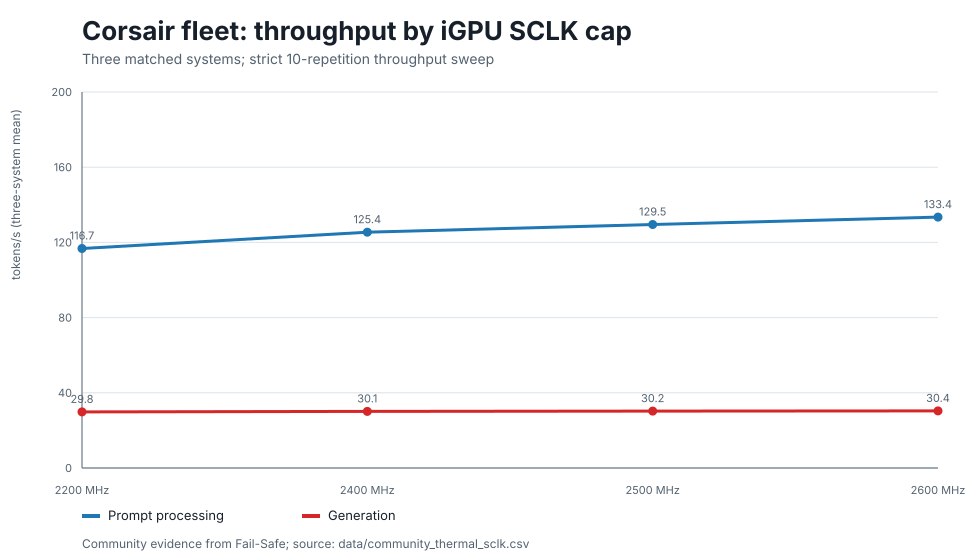
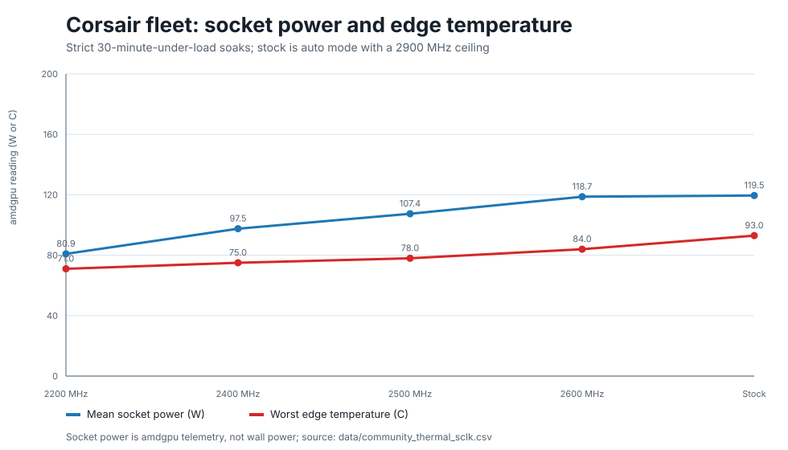

# Corsair / Sixunited Thermal And SCLK Evidence

This page turns [Fail-Safe's issue #24](https://github.com/hogeheer499-commits/strix-halo-guide/issues/24)
into scoped buyer and operator guidance for sustained local-AI inference on the
Corsair AI Workstation 300 / Sixunited AXB35 platform.

It is **not** a general recommendation to clock-cap every Corsair or AMD Strix
Halo system. The complete campaign is community evidence from three matched
systems in one managed fleet, not a first-party Beelink result or independent
cross-OEM reproduction.

## Short Answer

- If your system is stable and its stock/vendor fan controls are healthy, do
  not apply a clock cap just because this page exists.
- After a kernel update, verify that any out-of-tree EC/fan module rebuilt and
  that its dependent services actually started before running a sustained AI
  workload.
- On Fail-Safe's three matched Corsair systems, a 2400 MHz iGPU SCLK cap was the
  best measured conservative tradeoff: generation stayed within about 1% of
  the higher caps and every system stayed at or below 75 C in the strict soak.
- The original hard lock did not reproduce in the bounded stock controls. The
  root cause remains unresolved.

## Check This Before A Long Run

These names are specific to the contributed Corsair/Sixunited setup; another
vendor may use different firmware, modules, or services.

```bash
lsmod | grep -w ec_su_axb35
systemctl --no-pager --full status fan-curves.service apu-power-mode.service
journalctl -b -u fan-curves.service -u apu-power-mode.service
```

If the expected module or fan service is missing or failed, stop the sustained
workload and restore a known vendor/default fan-control path before continuing.
Do not assume that a configured custom curve is active merely because it worked
on the previous kernel.

## Measured Tradeoff

Every retained capped run used zero background containers and zero background
model processes. The three systems used the same model hashes, container
digest, runtime arguments, kernel, firmware packages, exposed fan settings, and
workload.

| iGPU SCLK cap | Prompt tok/s | Generation tok/s | Mean socket power | Worst edge temperature |
| ---: | ---: | ---: | ---: | ---: |
| 2200 MHz | 116.73 | 29.84 | 80.90 W | 71 C |
| 2400 MHz | 125.42 | 30.12 | 97.54 W | 75 C |
| 2500 MHz | 129.53 | 30.25 | 107.43 W | 78 C |
| 2600 MHz | 133.44 | 30.39 | 118.71 W | 84 C |

From 2400 to 2600 MHz, mean prompt throughput increased 6.39% and generation
increased only 0.87%, while mean sustained socket power increased 21.70% and
the worst observed edge temperature rose from 75 to 84 C.

<p align="center">
  
</p>

<p align="center">
  
</p>

The watt figures above are Linux AMDGPU **socket-power telemetry**, not external
wall-power measurements. Ambient room temperature and cooler/TIM condition were
not instrumented or independently verified.

## Bounded Stock Control

Fail-Safe then reset the OD table and returned the GPU to performance level
`auto`. Stock exposed a 2900 MHz ceiling but averaged about 2604 MHz under the
three long loads.

| Stock control | Mean loaded SCLK | Mean socket power | Maximum socket power | Worst edge temperature | Hard locks |
| --- | ---: | ---: | ---: | ---: | ---: |
| Three systems, 30 minutes under load each | about 2604 MHz | 119.54 W | 139.08 W | 93 C | 0/3 |

This does not prove unrestricted stock operation is categorically safe. One
system reached a 93 C transient, only 2 C below the campaign's safety cutoff,
and the original failure was intermittent rather than reproduced here.

## Root-Cause Correction

The original report said fan curves were not involved. Historical journals
later showed that two systems had booted a new kernel without the out-of-tree
`ec_su_axb35` module:

```text
modprobe: FATAL: Module ec_su_axb35 not found
```

The dependent custom fan-curve and APU power-mode services consequently failed.
Because that curve mode uses an active kernel work loop, the configured custom
fan response was not running while the module was absent.

This is a historically evidenced confounder and a plausible major contributor,
not a proven sole cause. The available records cannot establish whether the
earlier 180 W / 111 C event happened before or after the module was rebuilt, and
the difference from the later roughly 120 W sustained stock behavior may also
include workload duplication, kernel power management, or measurement-state
changes.

## Upstream Safety Fix

Based on this evidence, radupotop opened
[`ec-su_axb35-linux` PR #31](https://github.com/cmetz/ec-su_axb35-linux/pull/31).
The patch resets all fans to `AUTO` before the kernel module unloads so an active
software-controlled curve is not left behind without its control loop.

The PR is open and has been tested by its author on a Corsair AI Workstation
300. Treat it as an upstream candidate, not a released fix, until it is merged
and included in the installed module version.

## About The 2400 MHz Cap

The campaign's cap harness is preserved for audit and advanced reproduction:

- [`harness/README.md`](data/raw/2026-07-18/community-failsafe-corsair-thermal-sclk-issue24/harness/README.md)
- [`strix-sclk-cap`](data/raw/2026-07-18/community-failsafe-corsair-thermal-sclk-issue24/harness/strix-sclk-cap)
- [`systemd service`](data/raw/2026-07-18/community-failsafe-corsair-thermal-sclk-issue24/harness/strix-sclk-cap.service)
- [`reapply timer`](data/raw/2026-07-18/community-failsafe-corsair-thermal-sclk-issue24/harness/strix-sclk-cap.timer)

These files modify the AMDGPU overdrive interface and are **not** part of this
guide's beginner setup script. Read the harness and preserve a tested reset and
cleanup path before adapting them. Use a stable PCI device path rather than an
unstable `card0`/`card1` number, and pause any reapply timer while measuring a
different clock policy.

## Evidence And Reproduction

- Normalized rows: [`data/community_thermal_sclk.csv`](data/community_thermal_sclk.csv)
- Complete imported bundle: [`data/raw/2026-07-18/community-failsafe-corsair-thermal-sclk-issue24/`](data/raw/2026-07-18/community-failsafe-corsair-thermal-sclk-issue24/)
- Contributor graph: [`contributor-graph.svg`](data/raw/2026-07-18/community-failsafe-corsair-thermal-sclk-issue24/contributor-graph.svg)
- Original strict follow-up: [issue comment](https://github.com/hogeheer499-commits/strix-halo-guide/issues/24#issuecomment-5014049000)
- Root-cause correction: [issue comment](https://github.com/hogeheer499-commits/strix-halo-guide/issues/24#issuecomment-5014070252)

Run the contributor's checker from the imported raw directory:

```bash
python3 analyze.py
```

It recomputes the telemetry summaries, rejects incomplete or contaminated
retained runs, and verifies the recorded stock state.

## Vendor And Support Value

This campaign exposes a support gap more actionable than a raw speed headline:

- out-of-tree fan-control modules need reliable rebuild/update handling;
- a failed fan service must be visible before a sustained AI workload starts;
- unloading a software fan-control module needs a safe hardware fallback;
- firmware, fan, clock, temperature, and power guidance should be documented for
  sustained local-AI use rather than only short desktop workloads.

Useful next evidence is an independent bounded run on another Corsair/Sixunited
revision, plus confirmation of the merged/released upstream fan-reset behavior.
